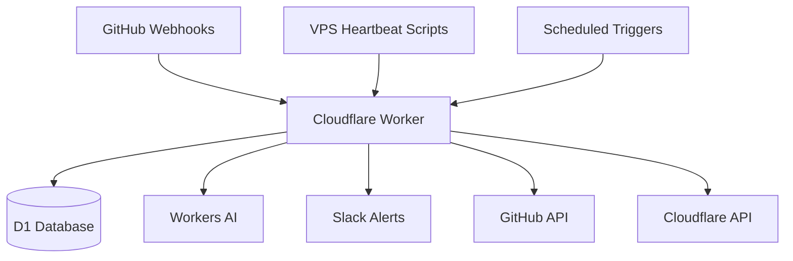
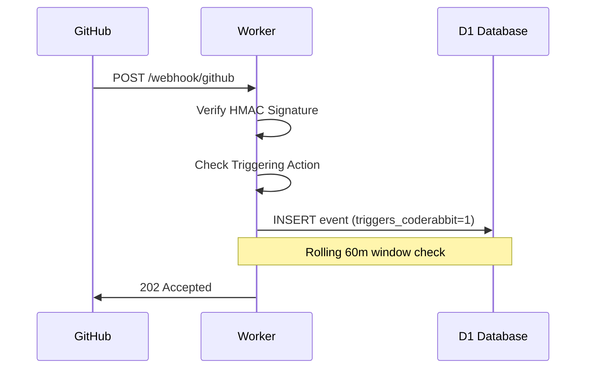

Relevant source files

The following files were used as context for generating this wiki page:

- [README.md](../../README.md)
- [worker/src/index.ts](../../worker/src/index.ts)
- [worker/schema.sql](../../worker/schema.sql)
- [AGENTS.md](../../AGENTS.md)
- [SECURITY.md](../../SECURITY.md)
- [clients/heartbeat.sh](../../clients/heartbeat.sh)

# Home & Overview

Ops-hub serves as a central automation node for webhooks and notifications from GitHub, VPS instances, and other service providers. Built as a Cloudflare Worker backed by a D1 database, it manages real-time quotas for CodeRabbit, monitors VPS statuses via heartbeats, and performs AI-driven triage for unresolved review threads.

Sources: [README.md:1-12](README.md#L1-L12), [AGENTS.md:1-6](AGENTS.md#L1-L6)

The system is designed to replace static scheduling with dynamic, data-driven decisions. It automates critical operational tasks such as auto-merge arming on GitHub, periodic health checks for external web applications, and automated maintenance of Cloudflare account tokens.

Sources: [README.md:14-41](README.md#L14-L41), [worker/src/index.ts:512-536](worker/src/index.ts#L512-L536)

## Core Features

| Feature | Description |
| :--- | :--- |
| **CodeRabbit Quota Tracking** | Tracks GitHub events in a rolling 60-minute window to manage CodeRabbit review limits. |
| **VPS Heartbeat Monitoring** | Receives pings from servers to track "last seen" status and system metrics (CPU/RAM). |
| **AI Triage & Escalation** | Uses Workers AI to classify unresolved CodeRabbit threads and escalate complex issues to Claude. |
| **Auto-merge Arming** | Automatically arms GitHub's native auto-merge (squash) for PRs meeting merge criteria. |
| **Health Monitoring** | Performs multi-point health checks for `politiker.denied.se` and alerts via Slack. |
| **Token Maintenance** | Automatically renews Cloudflare account tokens nearing expiration. |

Sources: [README.md:1-41](README.md#L1-L41), [worker/src/index.ts:182-205](worker/src/index.ts#L182-L205), [worker/src/index.ts:391-415](worker/src/index.ts#L391-L415)

## System Architecture

The project follows a standard pattern where incoming webhooks or scheduled cron jobs trigger logic that interacts with a D1 database and external APIs (GitHub, Slack, Cloudflare).

The diagram shows the flow of data from external sources into the central Worker and its interactions with various persistence and notification layers.
Sources: [README.md:43-52](README.md#L43-L52), [worker/src/index.ts:635-667](worker/src/index.ts#L635-L667)

### Data Components (D1 Schema)
The system relies on several tables within the D1 database to track state and history:
*  `events`: Stores raw GitHub webhook payloads and identifies CodeRabbit-triggering actions.
*  `heartbeats`: Records the status and system metrics of monitored VPS instances.
*  `healthcheck_state`: Manages the transition states for external health checks to prevent alert fatigue.
*  `thread_classifications`: Logs AI decisions regarding PR review threads.
*  `escalated_threads`: Tracks rate-limiting for automated Claude escalations.

Sources: [worker/schema.sql:1-68](worker/schema.sql#L1-L68), [worker/src/index.ts:435-455](worker/src/index.ts#L435-L455)

## API Endpoints

The Worker exposes several endpoints for interaction, protected by various secrets.

| Endpoint | Method | Purpose | Authentication |
| :--- | :--- | :--- | :--- |
| `/webhook/github` | POST | Receives GitHub organization/repo webhooks. | HMAC-SHA256 Signature |
| `/webhook/heartbeat` | POST | Receives VPS status updates. | `HEARTBEAT_SECRET` (Bearer) |
| `/coderabbit-quota` | GET | Returns current CodeRabbit usage and availability. | `QUERY_SECRET` (Bearer) |
| `/vps-status` | GET | Returns the latest status for all monitored sources. | `QUERY_SECRET` (Bearer) |

Sources: [README.md:54-65](README.md#L54-L65), [worker/src/index.ts:16-20](worker/src/index.ts#L16-L20)

### CodeRabbit Quota Logic
To avoid hitting the 5-reviews-per-hour limit on CodeRabbit Pro plans, the worker monitors specific GitHub actions (opened, synchronize, reopened, ready_for_review) and issue comments mentioning `@coderabbitai review`.

The sequence diagram illustrates how incoming GitHub events are verified and logged to track CodeRabbit usage.
Sources: [worker/src/index.ts:22-45](worker/src/index.ts#L22-L45), [worker/src/index.ts:446-465](worker/src/index.ts#L446-L465)

## AI Triage & Escalation

When an "unresolved" thread event is received from CodeRabbit, the system uses Workers AI (`@cf/meta/llama-3.1-8b-instruct`) to classify the finding.

1.  **Skip**: Trivial or stylistic findings.
2.  **Autofix**: Mechanical fixes (e.g., missing null checks) handled by other agents.
3.  **Escalate**: Complex issues requiring human or architectural decisions.

If escalated, the Worker posts a comment tagging `@claude` on the GitHub PR. This process is rate-limited to `MAX_ESCALATIONS_PER_PR` (3) to prevent infinite loops.

Sources: [README.md:13-24](README.md#L13-L24), [worker/src/index.ts:211-255](worker/src/index.ts#L211-L255), [worker/src/index.ts:311-340](worker/src/index.ts#L311-L340)

## Health Checks & Maintenance

The system performs periodic automated maintenance tasks via Cloudflare's `scheduled` handler.

### Health Checks (`politiker.denied.se`)
Running every 5 minutes, these checks verify:
*  Root HTTP 200 responses.
*  Valid JSON from API endpoints.
*  Cloudflare Domain-to-Service routing.
*  Existence of Worker scripts.
*  Minimum record counts in D1 databases.
*  Cloudflare Access application configuration.

Sources: [worker/src/index.ts:515-585](worker/src/index.ts#L515-L585)

### Token Renewal
On a weekly basis, the system checks managed Cloudflare account tokens. If a token is expiring within 30 days, it is automatically renewed for one year. The logic ensures that existing policies are preserved to prevent accidental permission stripping.

Sources: [worker/src/index.ts:480-510](worker/src/index.ts#L480-L510)

## Security and Compliance

The system implements several security measures:
*  **Signature Verification**: GitHub webhooks are validated using HMAC-SHA256.
*  **Secret Management**: Sensitive tokens (GITHUB_TOKEN, CF_ADMIN_TOKEN) are managed as Cloudflare Worker secrets.
*  **Agent Restrictions**: CI bypass and direct main branch pushes are forbidden for automated agents.
*  **Timeout Handling**: Outgoing requests use `AbortController` to prevent hanging processes.

Sources: [SECURITY.md:46-64](SECURITY.md#L46-L64), [AGENTS.md:16-23](AGENTS.md#L16-L23), [worker/src/index.ts:47-64](worker/src/index.ts#L47-L64)

## Summary

Ops-hub provides a robust, serverless infrastructure for managing GitHub workflows and server monitoring. By centralizing webhook handling and applying AI-driven triage, it reduces manual oversight and optimizes the use of automated tools like CodeRabbit and Claude. Its modular design allows for future expansion into other providers like Hostup or Anthropic status monitoring.

Sources: [README.md:118-132](README.md#L118-L132), [AGENTS.md:8-14](AGENTS.md#L8-L14)
