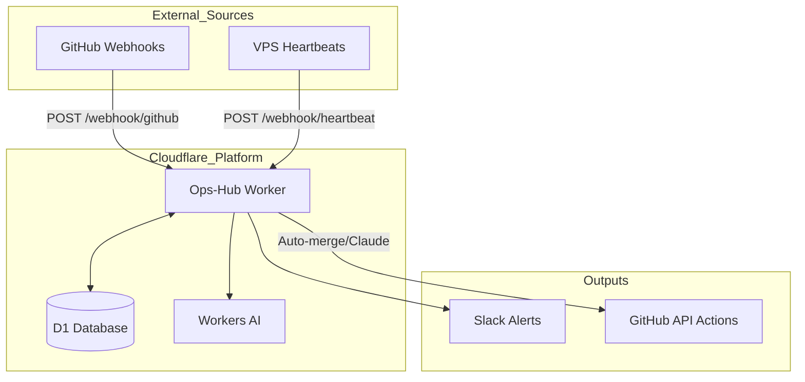

<details>
<summary>Relevant source files</summary>

The following files were used as context for generating this wiki page:

- [README.md](README.md)
- [worker/package.json](worker/package.json)
- [worker/src/index.ts](worker/src/index.ts)
- [worker/schema.sql](worker/schema.sql)
- [clients/heartbeat.sh](clients/heartbeat.sh)
- [AGENTS.md](AGENTS.md)
</details>

# Getting Started & Setup

Ops-hub serves as a central node for managing webhooks and notifications from GitHub, VPS instances, and other service providers. Its primary functions include tracking real-time CodeRabbit quota usage, monitoring VPS/service health via heartbeats, performing AI-driven triage on unresolved pull request threads, and automating GitHub auto-merge processes. Sources: [README.md:1-25](README.md#L1-L25), [AGENTS.md:1-7](AGENTS.md#L1-L7)

The system is architected as a Cloudflare Worker backed by a D1 SQL database. It utilizes Workers AI for thread classification and integrates with Slack for outbound alerting regarding health checks and token maintenance. Sources: [README.md:27-38](README.md#L27-L38), [worker/src/index.ts:1-15](worker/src/index.ts#L1-L15)

## System Architecture

The project consists of a core Worker implementation, a database schema for persistence, and client-side scripts for status reporting. Sources: [README.md:27-38](README.md#L27-L38)



The diagram above illustrates the data flow from external triggers (GitHub and VPS) through the Cloudflare Worker to its various integrated outputs and storage. Sources: [README.md:27-46](README.md#L27-L46), [worker/src/index.ts:517-545](worker/src/index.ts#L517-L545)

## Core Configuration & Secrets

The application requires several secrets to be configured within the Cloudflare environment via `wrangler secret put`. Sources: [README.md:65-76](README.md#L65-L76)

| Secret Name | Description | Required For |
| :--- | :--- | :--- |
| `GITHUB_WEBHOOK_SECRET` | Secret used to verify HMAC-SHA256 signatures from GitHub. | `/webhook/github` security |
| `HEARTBEAT_SECRET` | Bearer token for VPS/service status updates. | `/webhook/heartbeat` auth |
| `QUERY_SECRET` | Bearer token for accessing status and quota endpoints. | `/coderabbit-quota`, `/vps-status` |
| `GITHUB_TOKEN` | Fine-grained PAT with `issues:write` and `pull-requests:write`. | Auto-merge, Claude comments |
| `CF_ADMIN_TOKEN` | Cloudflare token with permissions to manage other account tokens. | Weekly token maintenance |
| `CF_READONLY_TOKEN` | Cloudflare token for monitoring Workers, D1, and Access apps. | Health checks |
| `SLACK_BOT_TOKEN` | Optional token for posting alerts to Slack. | Outbound notifications |

Sources: [README.md:65-81](README.md#L65-L81), [worker/src/index.ts:4-16](worker/src/index.ts#L4-L16)

## Database Setup

The project uses Cloudflare D1. The schema is defined in `worker/schema.sql` and must be initialized before deployment. Sources: [README.md:62-64](README.md#L62-L64), [worker/package.json:5-8](worker/package.json#L5-L8)

```sql
-- Create the D1 database instance
-- wrangler d1 create ops-hub-db

-- Events table for tracking webhook triggers
CREATE TABLE IF NOT EXISTS events (
  id INTEGER PRIMARY KEY AUTOINCREMENT,
  source TEXT NOT NULL,
  event_type TEXT NOT NULL,
  repo TEXT,
  triggers_coderabbit INTEGER NOT NULL DEFAULT 0,
  payload TEXT NOT NULL,
  received_at INTEGER NOT NULL
);
```

Sources: [worker/schema.sql:1-12](worker/schema.sql#L1-L12), [README.md:62-64](README.md#L62-L64)

### Deployment Steps
1. Install dependencies: `npm install` within the `worker` directory. Sources: [README.md:61](README.md#L61), [worker/package.json:11-16](worker/package.json#L11-L16)
2. Create D1 database: `wrangler d1 create ops-hub-db` and update `wrangler.jsonc` with the `database_id`. Sources: [README.md:62](README.md#L62)
3. Run migrations: `npm run db:migrate:remote`. Sources: [README.md:64](README.md#L64), [worker/package.json:8](worker/package.json#L8)
4. Configure Secrets: Apply all required tokens using `wrangler secret put`. Sources: [README.md:65-76](README.md#L65-L76)
5. Deploy Worker: `npm run deploy`. Sources: [README.md:82](README.md#L82), [worker/package.json:6](worker/package.json#L6)

## Webhook & Client Configuration

### GitHub Webhooks
Since personal accounts do not support organization-wide webhooks, webhooks must be configured per repository. Sources: [README.md:83-91](README.md#L83-L91)
- **Payload URL**: `https://ops-hub.<your-domain>/webhook/github`
- **Content Type**: `application/json`
- **Events**: Pull requests, Issue comments, Check runs, Pull request review threads.

### VPS Heartbeats
VPS monitoring is achieved by executing a script via cron. Sources: [README.md:92-95](README.md#L92-L95), [clients/heartbeat.sh:1-20](clients/heartbeat.sh#L1-L20)

```bash
# Example Cron Entry (every 5 minutes)
*/5 * * * * HEARTBEAT_SECRET=$(cat /path/to/secret) OPS_HUB_URL=https://ops-hub.<domain> /path/to/heartbeat.sh <source_id>
```

Sources: [README.md:94](README.md#L94), [clients/heartbeat.sh:11-20](clients/heartbeat.sh#L11-L20)

## API Endpoints

The Worker exposes endpoints for both ingestion and querying. Sources: [README.md:47-56](README.md#L47-L56)

| Method + Path | Auth Type | Purpose |
| :--- | :--- | :--- |
| `POST /webhook/github` | HMAC-SHA256 | Processes PR events, CodeRabbit triggers, and auto-merge requests. |
| `POST /webhook/heartbeat` | Bearer (Heartbeat) | Receives status pings from external servers. |
| `GET /coderabbit-quota` | Bearer (Query) | Calculates usage against the 5/hour CodeRabbit limit. |
| `GET /vps-status` | Bearer (Query) | Returns the last seen status for all monitored sources. |

Sources: [README.md:47-56](README.md#L47-L56), [worker/src/index.ts:517-543](worker/src/index.ts#L517-L543)

## Summary
Setting up Ops-hub requires a Cloudflare environment with D1 enabled and specific secrets configured for GitHub and Cloudflare API access. Once deployed, it centralizes operational intelligence by monitoring real-time quotas and service health through a combination of webhook processing and scheduled health checks. Sources: [README.md:1-25](README.md#L1-L25), [AGENTS.md:1-5](AGENTS.md#L1-L5)
