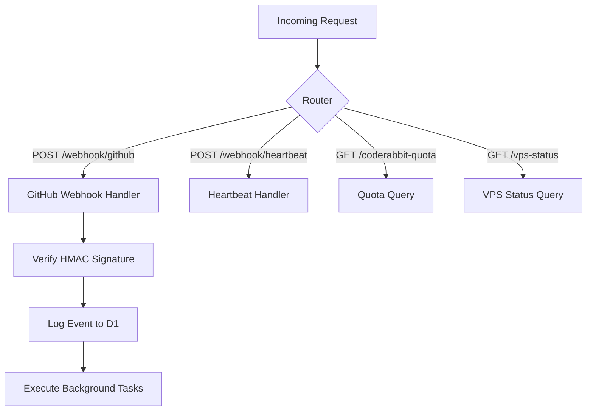
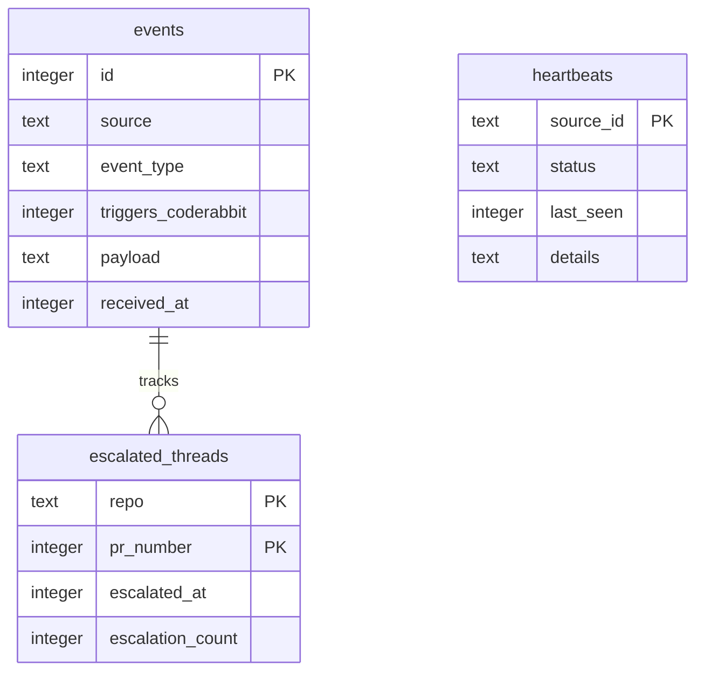

Relevant source files

The following files were used as context for generating this wiki page:

- [README.md](README.md)
- [AGENTS.md](AGENTS.md)
- [CLAUDE.md](CLAUDE.md)
- [SECURITY.md](SECURITY.md)
- [worker/src/index.ts](worker/src/index.ts)
- [worker/schema.sql](worker/schema.sql)
- [apply-ruleset.sh](apply-ruleset.sh)

# Developer Conventions

Developer conventions in the `ops-hub` project define the architectural boundaries, coding standards, and operational restrictions for maintaining a central node for webhooks and notifications. The project follows a minimalist approach, centralizing logic within a Cloudflare Worker backed by a D1 database to handle GitHub events, VPS heartbeats, and AI-driven triage.

These conventions ensure that infrastructure remains stable while enabling autonomous agents and human developers to collaborate safely. The system prioritizes security through HMAC signature verification and secret management, while enforcing strict rules on branch protection and automated merges.
Sources: [README.md:1-15](README.md#L1-L15), [AGENTS.md:5-15](AGENTS.md#L5-L15), [CLAUDE.md:1-6](CLAUDE.md#L1-L6)

## Code Structure and Implementation

The project adheres to a "keep it simple" philosophy for infrastructure code. Most logic is concentrated in a single entry point to reduce complexity and maintenance overhead.

### Core File Organization
*  **Logic Centralization**: All primary worker logic must reside in `worker/src/index.ts`. New event sources are added as specific routes within this file rather than creating new files.
*  **Database Schema**: The D1 database schema is maintained in `worker/schema.sql`. Any changes to the data model require updates to this file followed by remote migration.
*  **Version Control**: Deployment is managed via `wrangler`, with environment-specific configurations stored in `wrangler.jsonc`.

Sources: [AGENTS.md:9-12](AGENTS.md#L9-L12), [CLAUDE.md:6-7](CLAUDE.md#L6-L7), [worker/src/index.ts:1-10](worker/src/index.ts#L1-L10)

### Logic Flow Diagram
The following diagram illustrates how incoming requests are routed through the central worker logic.

The router directs traffic based on method and path, ensuring all GitHub webhooks are cryptographically verified before processing.
Sources: [worker/src/index.ts:700-726](worker/src/index.ts#L700-L726)

## AI Agent Guidelines and Restrictions

AI agents (such as Claude) interacting with the repository operate under specific permissions to prevent accidental infrastructure degradation or security breaches.

### Allowed and Forbidden Actions
| Category | Permitted Actions | Forbidden Actions |
| :--- | :--- | :--- |
| **Development** | Create branches, Modify code, Run tests, Open PRs | Push directly to main, Merge PRs, Delete branches |
| **Infrastructure** | Query status endpoints | Modify secrets, Change GitHub Org settings, Disable workflows |

Sources: [AGENTS.md:17-30](AGENTS.md#L17-L30)

### AI Triage and Escalation Logic
The system uses Workers AI to classify CodeRabbit findings. Developers must follow the escalation protocol:
1.  **Triage**: Findings are classified as `skip` (trivial), `autofix` (mechanical), or `escalate` (architectural).
2.  **Debounce**: Escalations are limited to one every 30 minutes per PR to prevent notification loops.
3.  **Threshold**: A maximum of 3 escalations (`MAX_ESCALATIONS_PER_PR`) is permitted per PR.

Sources: [worker/src/index.ts:178-200](worker/src/index.ts#L178-L200), [README.md:20-30](README.md#L20-L30)

## Security and Authentication

Security is a primary pillar of the developer conventions, focusing on the protection of credentials and the integrity of incoming data.

### Authentication Mechanisms
*  **GitHub Webhooks**: Validated using `X-Hub-Signature-256` and a shared `GITHUB_WEBHOOK_SECRET`.
*  **Internal Endpoints**: Access to `/coderabbit-quota` and `/vps-status` requires `Authorization: Bearer <QUERY_SECRET>`.
*  **Heartbeat Source**: VPS pinging requires `Authorization: Bearer <HEARTBEAT_SECRET>`.

Sources: [README.md:46-52](README.md#L46-L52), [worker/src/index.ts:25-50](worker/src/index.ts#L25-L50)

### Secret Management
*  **No Hardcoding**: Credentials, tokens, or passphrases must never be committed to the repository.
*  **Wrangler Secrets**: All production secrets (e.g., `CF_ADMIN_TOKEN`, `SLACK_WEBHOOK_URL`) are managed through `wrangler secret put`.
*  **OAuth Security**: Implementation must be PKCE-based, ensuring the client never carries a secret.

Sources: [SECURITY.md:46-55](SECURITY.md#L46-L55), [README.md:62-75](README.md#L62-L75)

## Database Conventions

The project utilizes Cloudflare D1. Developers must ensure that all queries and table definitions support the specific monitoring and triage features of the hub.

### Data Model Overview

The schema is designed for high-frequency writes (webhooks) and efficient time-window queries (quota counting).
Sources: [worker/schema.sql:1-55](worker/schema.sql#L1-L55)

### Schema Table Descriptions
| Table | Purpose | Key Fields |
| :--- | :--- | :--- |
| `events` | Raw log of all incoming webhooks | `source`, `triggers_coderabbit`, `received_at` |
| `heartbeats` | Latest status for external servers | `source_id`, `status`, `last_seen` |
| `thread_classifications` | Logs AI triage decisions | `action`, `reasoning`, `pr_number` |
| `healthcheck_state` | Tracks OK/FAIL transitions for alerts | `check_id`, `ok`, `since`, `last_alert` |

Sources: [worker/schema.sql:1-75](worker/schema.sql#L1-L75)

## Branch and Merge Standards

Developers must adhere to strict branch protection rules, which are standardized via a template.

*  **Main Protection**: The `main` branch is protected. Direct pushes and deletions are prohibited.
*  **Auto-Merge**: The worker arms GitHub's native auto-merge (squash) only when checks are green or status is `CLEAN`.
*  **Ruleset Application**: Branch rulesets should be applied using the `apply-ruleset.sh` script, which enforces `required_status_checks` for CodeRabbit and prohibits non-fast-forward pushes.

Sources: [branch-ruleset-template.json:1-40](branch-ruleset-template.json#L1-L40), [apply-ruleset.sh:1-12](apply-ruleset.sh#L1-L12), [README.md:32-35](README.md#L32-L35)

## Summary of Maintenance Tasks

Maintenance is automated via cron jobs defined in the worker's `scheduled` handler:
*  **Healthchecks**: Runs every 5 minutes to monitor `politiker.denied.se`.
*  **Daily Summaries**: Posted at 07:00 UTC.
*  **Token Maintenance**: Performed weekly (Monday at 07:00 UTC) to renew Cloudflare account tokens expiring within 30 days.

Sources: [worker/src/index.ts:742-758](worker/src/index.ts#L742-L758), [README.md:36-43](README.md#L36-L43)
