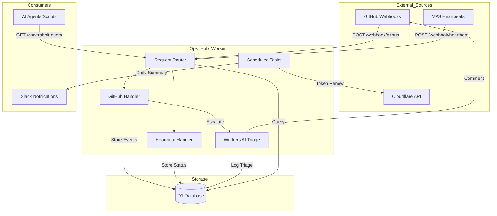
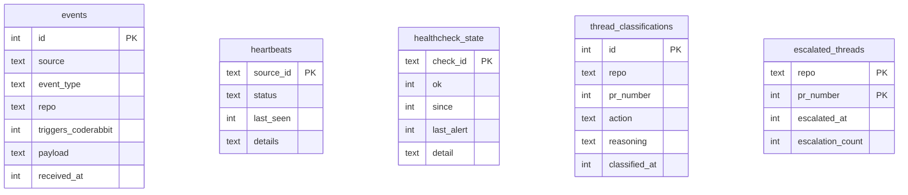
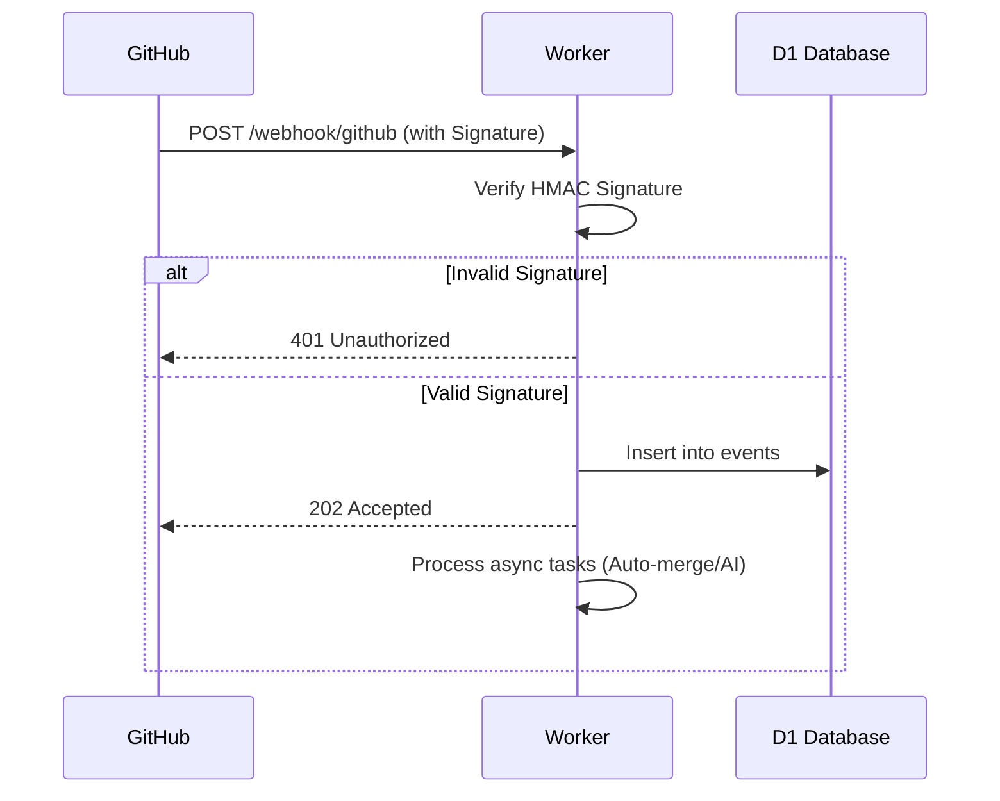

Relevant source files

The following files were used as context for generating this wiki page:

- [README.md](../../README.md)
- [worker/src/index.ts](../../worker/src/index.ts)
- [worker/schema.sql](../../worker/schema.sql)
- [AGENTS.md](../../AGENTS.md)
- [clients/heartbeat.sh](../../clients/heartbeat.sh)
- [CLAUDE.md](../../CLAUDE.md)

# High-Level Architecture

The **ops-hub** project serves as a central hub for webhooks and notifications from GitHub, VPS instances, and Cloudflare services. It is designed to provide real-time decision-making capabilities, such as tracking CodeRabbit review quotas and VPS health, which cannot be achieved through static scheduling alone.

The system is implemented as a single Cloudflare Worker backed by a D1 SQL database. It handles incoming webhooks, executes scheduled cron jobs for maintenance and health checks, and exposes query endpoints for status retrieval.

Sources: [README.md:1-10](README.md#L1-L10), [AGENTS.md:1-5](AGENTS.md#L1-L5), [CLAUDE.md:1-5](CLAUDE.md#L1-L5)

## System Components and Data Flow

The architecture follows a "Webhook In → D1 Storage → Query Out" pattern. The central Cloudflare Worker handles all logic, while D1 provides persistent storage for events, heartbeats, and state management.

The diagram illustrates the flow of information from external providers into the worker, the persistence in D1, and the subsequent consumption by agents or Slack alerts.
Sources: [README.md:95-103](README.md#L95-L103), [worker/src/index.ts:770-805](worker/src/index.ts#L770-L805)

## Core Features

### 1. CodeRabbit Quota Management
Instead of using a static stagger schedule, the system tracks actual GitHub events that trigger CodeRabbit reviews within a rolling 60-minute window. This allows agents to query `GET /coderabbit-quota` to determine if it is safe to push a change without exceeding the Pro-plan limit of 5 reviews per hour.
Sources: [README.md:12-21](README.md#L12-L21), [worker/src/index.ts:686-710](worker/src/index.ts#L686-L710)

### 2. VPS Heartbeats
VPS instances (e.g., `mp100`) send periodic pings containing system metrics (CPU, RAM, Disk) to the `/webhook/heartbeat` endpoint. The current status of all servers is exposed via `GET /vps-status`.
Sources: [README.md:22-24](README.md#L22-L24), [clients/heartbeat.sh:10-20](clients/heartbeat.sh#L10-L20), [worker/src/index.ts:672-684](worker/src/index.ts#L672-L684)

### 3. AI-Powered Triage and Escalation
When a CodeRabbit review thread is marked as `unresolved`, the worker uses Workers AI (`@cf/meta/llama-3.1-8b-instruct`) to classify the finding. 
*  **skip**: Trivial findings.
*  **autofix**: Mechanically fixable issues.
*  **escalate**: Requires human/architectural decision. 

Only `escalate` actions trigger a `@claude` comment on the PR, subject to a debounce and a maximum of 3 escalations per PR to prevent infinite loops.
Sources: [README.md:25-36](README.md#L25-L36), [worker/src/index.ts:250-305](worker/src/index.ts#L250-L305), [worker/src/index.ts:340-400](worker/src/index.ts#L340-L400)

### 4. Automated Maintenance
*  **Auto-merge**: Monitors `check_run` and `pull_request` events to automatically arm GitHub's native auto-merge (squash) for clean PRs.
*  **Health Checks**: Performs six specific checks on the `politiker.denied.se` domain every 5 minutes, alerting Slack only on state transitions.
*  **Token Rotation**: Weekly checks and renewal of Cloudflare account tokens expiring within 30 days.
Sources: [README.md:37-56](README.md#L37-L56), [worker/src/index.ts:130-180](worker/src/index.ts#L130-L180), [worker/src/index.ts:497-550](worker/src/index.ts#L497-L550), [worker/src/index.ts:555-610](worker/src/index.ts#L555-L610)

## API Endpoints

The following endpoints are exposed by the worker for integration with GitHub and external monitoring scripts.

| Method + Path | Purpose | Authentication |
|:---|:---|:---|
| `POST /webhook/github` | Receives GitHub organization/repo webhooks | HMAC-SHA256 (`X-Hub-Signature-256`) |
| `POST /webhook/heartbeat` | Receives status updates from VPS/Services | `Bearer <HEARTBEAT_SECRET>` |
| `GET /coderabbit-quota` | Returns used vs available review quota | `Bearer <QUERY_SECRET>` |
| `GET /vps-status` | Returns the latest status for all heartbeat sources | `Bearer <QUERY_SECRET>` |

Sources: [README.md:105-115](README.md#L105-L115), [worker/src/index.ts:770-800](worker/src/index.ts#L770-L800)

## Data Model (D1 Schema)

The D1 database stores the state of the hub. The schema is optimized for event logging and state transition tracking.

Sources: [worker/schema.sql:1-70](worker/schema.sql#L1-L70)

### Database Table Descriptions

| Table | Description |
|:---|:---|
| `events` | Logs raw GitHub webhooks and internal automation events. |
| `heartbeats` | Stores the most recent status and hardware metrics for external servers. |
| `healthcheck_state` | Tracks the success/failure state of domain health checks for transition-based alerting. |
| `thread_classifications` | Logs the AI's reasoning and action for every processed CodeRabbit thread. |
| `escalated_threads` | Manages the debounce logic and escalation counts for PR comments. |

Sources: [worker/schema.sql:1-70](worker/schema.sql#L1-L70), [worker/src/index.ts:405-420](worker/src/index.ts#L405-L420)

## Security and Authentication

The system implements several security layers to protect the infrastructure:
1.  **Webhook Verification**: GitHub payloads are verified using HMAC-SHA256 with `GITHUB_WEBHOOK_SECRET`.
2.  **Bearer Tokens**: Internal endpoints (`/webhook/heartbeat`, `/vps-status`, etc.) require distinct Bearer tokens.
3.  **Scoped Permissions**: The `GITHUB_TOKEN` is a fine-grained PAT limited to specific repositories.
4.  **Credential Safety**: Secrets and tokens never leave the worker unencrypted.
5.  **Timeout Protection**: All outgoing fetches (to GitHub, Slack, or Cloudflare) use a `fetchWithTimeout` wrapper to prevent worker hangs.

Sources: [worker/src/index.ts:32-75](worker/src/index.ts#L32-L75), [SECURITY.md:40-55](SECURITY.md#L40-L55), [AGENTS.md:15-20](AGENTS.md#L15-L20)

Sources: [worker/src/index.ts:430-460](worker/src/index.ts#L430-L460)

## Summary
The **ops-hub** architecture provides a robust, serverless centralized controller for devops workflows. By combining Cloudflare Workers, D1, and Workers AI, it transforms static monitoring into a real-time reactive system capable of managing quotas, triaging PR reviews, and maintaining infrastructure health with minimal overhead.
