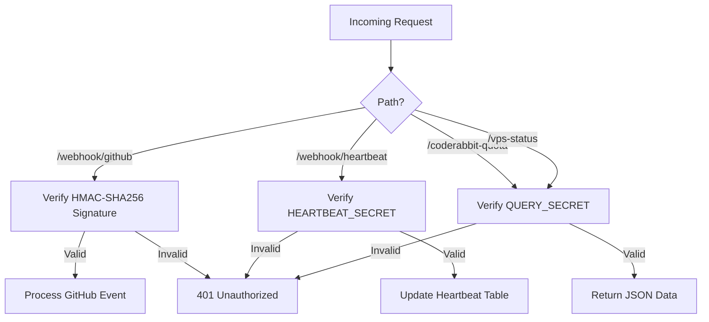
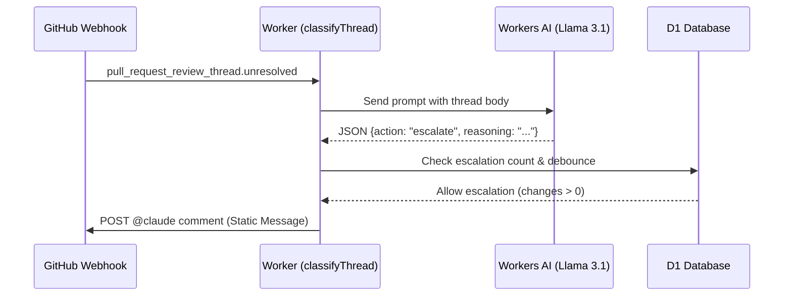

Relevant source files

The following files were used as context for generating this wiki page:

- [SECURITY.md](SECURITY.md)
- [README.md](README.md)
- [AGENTS.md](AGENTS.md)
- [worker/src/index.ts](worker/src/index.ts)
- [apply-ruleset.sh](apply-ruleset.sh)
- [worker/schema.sql](worker/schema.sql)

# Security Architecture

The Security Architecture of the `ops-hub` project is designed to protect a central node handling webhooks and notifications from GitHub, VPS instances, and other services. It leverages Cloudflare Workers' secure environment and D1 database to process sensitive operational data while enforcing strict access controls and integrity checks on incoming requests.

The architecture emphasizes the protection of SSH keys, OAuth tokens, and API secrets. It employs a combination of HMAC signature verification for GitHub events, Bearer token authentication for internal endpoints, and robust secret management to ensure that sensitive data never leaves the system unencrypted.

Sources: [README.md:3-33](README.md#L3-L33), [SECURITY.md:54-61](SECURITY.md#L54-L61), [worker/src/index.ts:1-20](worker/src/index.ts#L1-L20)

## Authentication and Authorization

Ops-hub implements different authentication mechanisms based on the source and nature of the request. These ensure that only authorized entities can trigger webhooks or query internal status endpoints.

### Request Validation Flow

The following diagram illustrates how the system differentiates and validates requests from various sources:

Sources: [worker/src/index.ts:140-145](worker/src/index.ts#L140-L145), [worker/src/index.ts:173-176](worker/src/index.ts#L173-L176), [worker/src/index.ts:22-24](worker/src/index.ts#L22-L24)

### Implementation Details

| Mechanism | Description | Implementation |
| :--- | :--- | :--- |
| **GitHub HMAC** | Validates `X-Hub-Signature-256` using a shared secret to ensure payload integrity. | `verifyGitHubSignature` function using Web Crypto API. |
| **Bearer Auth** | Uses `HEARTBEAT_SECRET` or `QUERY_SECRET` provided in the `Authorization` header. | `isAuthorizedQuery` and `handleHeartbeat` functions. |
| **PKCE-based OAuth** | Mobile/Desktop clients use PKCE to ensure client secrets are not stored in the app. | Defined in security policy for connected apps. |

Sources: [worker/src/index.ts:26-47](worker/src/index.ts#L26-L47), [SECURITY.md:44-45](SECURITY.md#L44-L45), [worker/src/index.ts:22-24](worker/src/index.ts#L22-L24)

## Secret Management

The project follows strict guidelines for handling sensitive credentials. Secrets are never committed to the repository and are managed through Cloudflare's environment variables or system-level keychains.

*  **No Cleartext Storage:** API keys and OAuth tokens are stored in the system's Keychain (iOS/macOS) and never as cleartext on disk.
*  **Encrypted Sync:** Sensitive data is encrypted using AES-256-GCM + PBKDF2 before leaving a device during synchronization.
*  **Infrastructure Secrets:** Cloudflare Worker secrets (e.g., `GITHUB_TOKEN`, `CF_ADMIN_TOKEN`) are managed via `wrangler secret put`.

Sources: [SECURITY.md:43-57](SECURITY.md#L43-L57), [README.md:83-93](README.md#L83-L93), [worker/src/index.ts:3-18](worker/src/index.ts#L3-L18)

## Automated Security and Triage

The system includes automated logic for responding to security-related events or review findings.

### AI-Driven Escalation
When an unresolved thread is detected from CodeRabbit, the system uses Workers AI to classify the threat. To prevent **Prompt Injection (CWE-1427)**, the escalation message sent back to GitHub is static and does not interpolate the untrusted thread content directly into the prompt.

Sources: [worker/src/index.ts:182-205](worker/src/index.ts#L182-L205), [worker/src/index.ts:228-235](worker/src/index.ts#L228-L235), [worker/src/index.ts:246-261](worker/src/index.ts#L246-L261)

### CodeRabbit Quota Management
To prevent exhaustion of the CodeRabbit review quota (5 per hour), the system tracks triggering events in the D1 database and provides a `safe_to_trigger_now` status to clients. This prevents "blind" triggering of expensive operations.

Sources: [README.md:12-16](README.md#L12-L16), [worker/src/index.ts:208-226](worker/src/index.ts#L208-L226)

## Agent Restrictions

The `AGENTS.md` file defines explicit security boundaries for AI agents interacting with the repository. This "Guardrail" approach prevents automated systems from compromising the project's integrity.

*  **Forbidden Actions:** Agently accounts are strictly forbidden from pushing directly to the `main` branch, merging PRs, disabling workflows, or modifying secrets.
*  **Bypass Prevention:** Branch protection rules (rulesets) are applied to the `main` branch, requiring status checks from CodeRabbit. These rulesets are applied via scripts that agents are not permitted to run with elevated privileges.

Sources: [AGENTS.md:15-22](AGENTS.md#L15-L22), [apply-ruleset.sh:1-12](apply-ruleset.sh#L1-L12), [branch-ruleset-template.json:1-38](branch-ruleset-template.json#L1-L38)

## Infrastructure Health & Maintenance

Security also encompasses the maintenance of the infrastructure itself.

*  **Token Maintenance:** A weekly cron job (`maintainCfTokens`) checks Cloudflare account tokens. Tokens expiring within 30 days are automatically renewed for exactly one year to prevent service outages.
*  **Health Checks:** Every 5 minutes, the system performs health checks on the `politiker.denied.se` domain, verifying root accessibility, API validity, and D1 database integrity. Slack alerts are sent only on state transitions (OK to FAIL) to prevent alert fatigue.

Sources: [worker/src/index.ts:358-406](worker/src/index.ts#L358-L406), [worker/src/index.ts:425-498](worker/src/index.ts#L425-L498), [worker/src/index.ts:511-534](worker/src/index.ts#L511-L534)

## Summary

The `ops-hub` Security Architecture is a multi-layered system combining traditional authentication (HMAC, Bearer tokens) with modern serverless security practices (Cloudflare Workers, D1). By restricting agent actions, automating secret rotation, and utilizing AI for secure triage without exposing the system to prompt injection, the architecture maintains a robust posture against both external attacks and internal automation errors.
