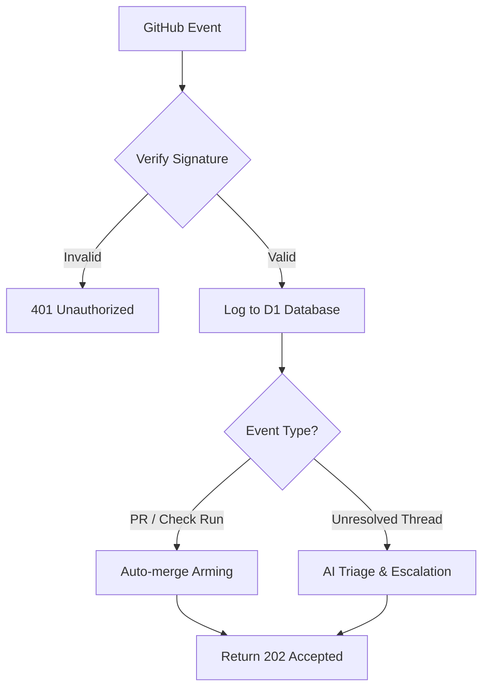
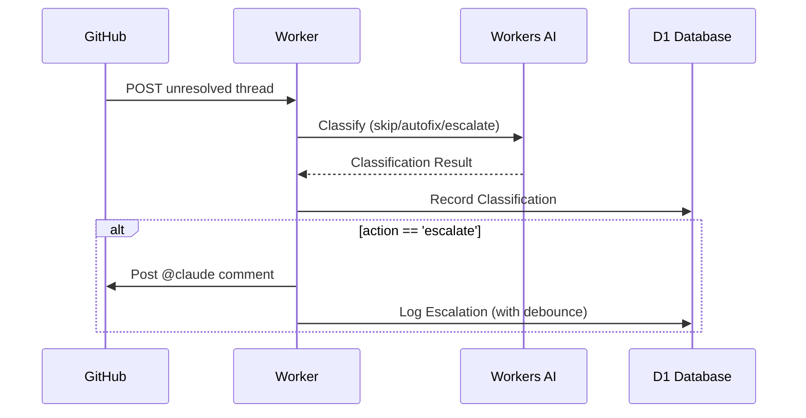

Relevant source files

The following files were used as context for generating this wiki page:

- [worker/src/index.ts](worker/src/index.ts)
- [README.md](README.md)
- [worker/schema.sql](worker/schema.sql)
- [AGENTS.md](AGENTS.md)
- [branch-ruleset-template.json](branch-ruleset-template.json)

# GitHub Webhook Receiver

The GitHub Webhook Receiver is a core component of the `ops-hub` project, implemented as a Cloudflare Worker. It acts as a central ingestion point for various GitHub events, including Pull Requests, Check Runs, and Issue Comments. Its primary purpose is to automate repository maintenance tasks, track CodeRabbit review quotas, and facilitate AI-driven triage for unresolved review threads.

Sources: [worker/src/index.ts:1-15](worker/src/index.ts#L1-L15), [README.md:1-20](README.md#L1-L20), [AGENTS.md:1-10](AGENTS.md#L1-L10)

## Architecture and Data Flow

The receiver operates on a request-response model where GitHub sends HTTP POST requests to the `/webhook/github` endpoint. Each request is validated using HMAC-SHA256 signatures before being processed. Validated events are stored in a D1 database and may trigger asynchronous background tasks via `ctx.waitUntil`.

The following diagram illustrates the high-level flow of a GitHub webhook event through the system:

A flowchart showing the validation, logging, and conditional processing of incoming GitHub webhook events.
Sources: [worker/src/index.ts:311-337](worker/src/index.ts#L311-L337), [README.md:46-51](README.md#L46-L51)

## Key Functionalities

### 1. CodeRabbit Quota Tracking
The receiver identifies events likely to trigger a CodeRabbit review (e.g., PR opening or synchronization). These events are flagged in the `events` table with `triggers_coderabbit = 1`. This data is used by the `/coderabbit-quota` endpoint to provide real-time feedback on whether it is safe to trigger new reviews within a rolling 60-minute window.

Sources: [worker/src/index.ts:21-25](worker/src/index.ts#L21-L25), [worker/src/index.ts:358-380](worker/src/index.ts#L358-L380), [README.md:1-10](README.md#L1-L10)

### 2. Auto-merge Arming
The system automatically arms GitHub's native auto-merge (squash) functionality for Pull Requests that meet specific criteria (e.g., state is CLEAN or MERGEABLE with passing status checks). This replaces manual or timer-based merge routines.

| Component | Description |
|---|---|
| `autoMergeCandidates` | Identifies PR numbers from `pull_request` and `check_run` events. |
| `maybeArmAutoMerge` | Checks PR status and executes GraphQL mutations to enable auto-merge or merge directly if already clean. |
| `githubGraphQL` | Helper function for authenticated communication with GitHub's GraphQL API. |

Sources: [worker/src/index.ts:74-165](worker/src/index.ts#L74-L165), [README.md:27-30](README.md#L27-L30)

### 3. AI-Driven Thread Triage
When a `pull_request_review_thread` event with the action `unresolved` is received, the system uses Workers AI (`@cf/meta/llama-3.1-8b-instruct`) to classify the thread.

A sequence diagram detailing the interaction between the Worker, Workers AI, and GitHub for thread triage.
Sources: [worker/src/index.ts:187-250](worker/src/index.ts#L187-L250), [README.md:11-20](README.md#L11-L20)

## Database Schema

GitHub events and associated processing states are persisted in several D1 tables.

| Table | Purpose | Key Fields |
|---|---|---|
| `events` | Logs all incoming webhooks and CodeRabbit triggers. | `source`, `event_type`, `repo`, `triggers_coderabbit`, `payload` |
| `thread_classifications` | Stores AI classification results for review threads. | `repo`, `pr_number`, `action`, `reasoning` |
| `escalated_threads` | Manages debouncing and limits for AI escalations. | `repo`, `pr_number`, `escalated_at`, `escalation_count` |

Sources: [worker/schema.sql:1-48](worker/schema.sql#L1-L48)

## Security and Verification

The system enforces strict security measures for all incoming webhooks:
- **Signature Verification:** Uses the `X-Hub-Signature-256` header and a `GITHUB_WEBHOOK_SECRET` to verify payload integrity via HMAC-SHA256.
- **Authentication:** Outgoing calls to GitHub use a fine-grained Personal Access Token (PAT) stored as `GITHUB_TOKEN`.
- **Throttling:** Escalations are limited to `MAX_ESCALATIONS_PER_PR` (default: 3) and enforced with a 30-minute debounce period to prevent infinite loops.

Sources: [worker/src/index.ts:31-54](worker/src/index.ts#L31-L54), [worker/src/index.ts:178-185](worker/src/index.ts#L178-L185), [README.md:52-65](README.md#L52-L65)

## Conclusion
The GitHub Webhook Receiver serves as the automated backbone of the `ops-hub` infrastructure. By integrating real-time event logging with AI classification and GraphQL-based automation, it ensures repository standards are maintained while optimizing the use of third-party tools like CodeRabbit and Claude.
