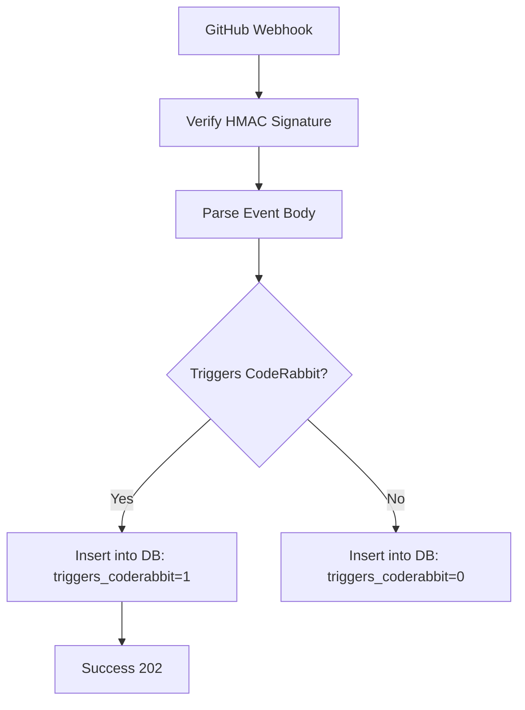
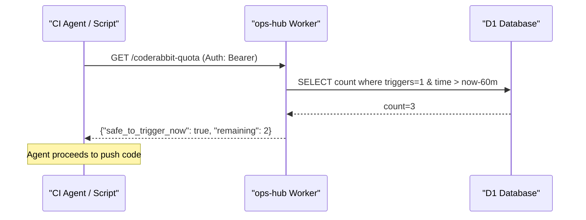

<details>
<summary>Relevant source files</summary>

The following files were used as context for generating this wiki page:

- [worker/src/index.ts](worker/src/index.ts)
- [README.md](README.md)
- [worker/schema.sql](worker/schema.sql)
- [AGENTS.md](AGENTS.md)
- [branch-ruleset-template.json](branch-ruleset-template.json)

</details>

# Real-time CodeRabbit Quota Tracking

## Introduction
Real-time CodeRabbit Quota Tracking is a specialized monitoring system within the `ops-hub` project designed to manage and track the usage of CodeRabbit AI code reviews. Instead of relying on static scheduling or external metrics that only provide historical data, this system tracks actual GitHub events that trigger reviews in a rolling 60-minute window. This allows agents or scripts to query the status via a dedicated endpoint to determine if it is "safe to trigger" a new review immediately, avoiding rate-limit queues.

Sources: [README.md:11-18](README.md#L11-L18), [README.md:129-132](README.md#L129-L132), [AGENTS.md:6-8](AGENTS.md#L6-L8)

## System Architecture and Data Flow
The tracking system is built on a Cloudflare Worker architecture using a D1 SQL database to persist event data. It functions by intercepting GitHub webhooks, identifying specific actions that consume the CodeRabbit quota, and storing these events with a specific flag.

### Event Processing Flow
1. **Webhook Reception**: The Worker receives a `POST` request from GitHub at `/webhook/github`.
2. **Signature Verification**: The request is validated using HMAC-SHA256 signature verification against a `GITHUB_WEBHOOK_SECRET`.
3. **Trigger Identification**: The logic checks if the event type and action are known to trigger a CodeRabbit review (e.g., opening a PR or commenting `@coderabbitai review`).
4. **Data Persistence**: The event is logged into the `events` table in the D1 database with the `triggers_coderabbit` column set to `1`.



The diagram shows the logic flow from receiving a GitHub webhook to determining if it counts against the CodeRabbit quota.
Sources: [worker/src/index.ts:24-43](worker/src/index.ts#L24-L43), [worker/src/index.ts:57-67](worker/src/index.ts#L57-L67), [worker/src/index.ts:255-276](worker/src/index.ts#L255-L276), [worker/schema.sql:3-13](worker/schema.sql#L3-L13)

## Quota Logic and Calculation
The quota is calculated based on a rolling 60-minute window. The system specifically monitors the "Pro-plan" limit, which is identified as 5 reviews per hour across the account.

### Triggering Criteria
An event is marked as a CodeRabbit trigger if it matches specific GitHub actions or comment patterns:
*  **Pull Requests**: `opened`, `synchronize`, `reopened`, or `ready_for_review`.
*  **Issue Comments**: Any comment containing the regex `@coderabbitai\s+review`.

Sources: [worker/src/index.ts:18-21](worker/src/index.ts#L18-L21), [worker/src/index.ts:57-67](worker/src/index.ts#L57-L67)

### Data Model
The tracking relies on the `events` table in D1.

| Field | Type | Description |
| :--- | :--- | :--- |
| `id` | INTEGER | Primary Key (Auto-increment) |
| `source` | TEXT | Origin of the event (e.g., 'github') |
| `event_type` | TEXT | Specific event and action (e.g., 'pull_request.opened') |
| `triggers_coderabbit` | INTEGER | Boolean flag (1 = counts against quota, 0 = does not) |
| `received_at` | INTEGER | Unix epoch seconds of event reception |

Sources: [worker/schema.sql:3-13](worker/schema.sql#L3-L13)

## Quota Query Endpoint
The system exposes a `GET /coderabbit-quota` endpoint for external consumption. This endpoint requires Bearer authentication using the `QUERY_SECRET`.

### Query Implementation
When queried, the Worker performs the following SQL operation to calculate the current usage:

```sql
SELECT COUNT(*) AS n FROM events 
WHERE triggers_coderabbit = 1 
AND received_at >= ?
```

The parameter `?` is the current Unix timestamp minus 3600 seconds.

Sources: [worker/src/index.ts:303-311](worker/src/index.ts#L303-L311), [worker/src/index.ts:392-395](worker/src/index.ts#L392-L395)

### Response Structure
The endpoint returns a JSON object providing real-time status:
*  `used`: Number of triggers in the last 60 minutes.
*  `limit`: Hardcoded limit (currently 5).
*  `remaining`: Calculated capacity.
*  `safe_to_trigger_now`: Boolean indicating if the current usage is below the limit.
*  `recent_events`: A list of the most recent triggering events for debugging.

Sources: [worker/src/index.ts:314-323](worker/src/index.ts#L314-L323)

## Integration with Repository Standards
The quota tracking is designed to replace static "stagger" schedules used in `repo-standard`. By providing a dynamic `safe_to_trigger_now` signal, automation agents can proceed with pushes or triggers immediately if quota is available, rather than waiting for pre-defined time windows.

Furthermore, repository branch rulesets (as defined in `branch-ruleset-template.json`) enforce CodeRabbit as a required status check, making real-time availability tracking critical for maintaining CI/CD velocity.



This sequence illustrates how an external agent interacts with the quota tracking system before initiating an action that would trigger CodeRabbit.
Sources: [README.md:11-18](README.md#L11-L18), [branch-ruleset-template.json:28-33](branch-ruleset-template.json#L28-L33)

## Conclusion
Real-time CodeRabbit Quota Tracking provides a necessary visibility layer over the account-wide review limits imposed by CodeRabbit AI. By leveraging GitHub webhooks and a rolling window calculation in Cloudflare Workers, it enables more efficient CI/CD workflows by allowing automated agents to react to actual resource availability rather than conservative static schedules.

Sources: [README.md:129-140](README.md#L129-L140)
