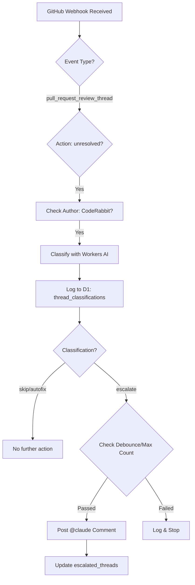
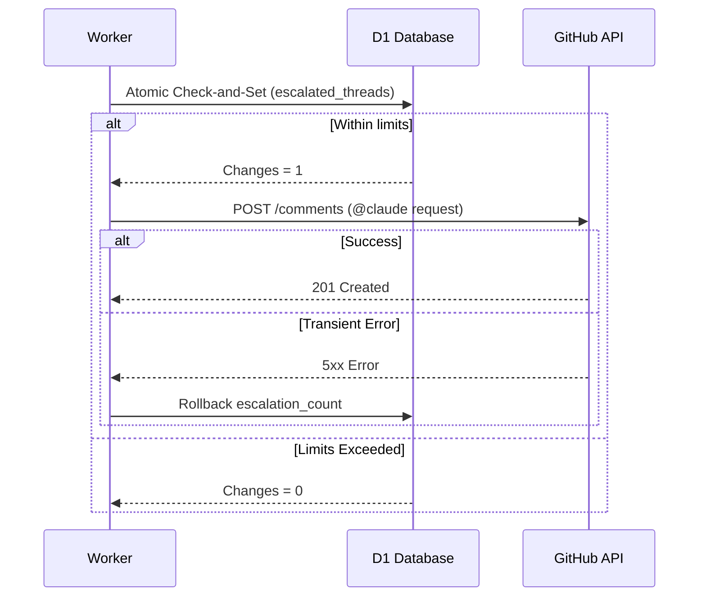

<details>
<summary>Relevant source files</summary>

The following files were used as context for generating this wiki page:

- [worker/src/index.ts](worker/src/index.ts)
- [README.md](README.md)
- [worker/schema.sql](worker/schema.sql)
- [AGENTS.md](AGENTS.md)
- [CLAUDE.md](CLAUDE.md)
</details>

# AI Triage of CodeRabbit Threads

The **AI Triage of CodeRabbit Threads** is a specialized feature within the `ops-hub` system designed to manage and automate the response to unresolved review threads generated by the CodeRabbit AI. When CodeRabbit identifies an issue in a Pull Request (PR) and marks a thread as `unresolved`, this system utilizes Cloudflare Workers AI to classify the finding. The primary goal is to distinguish between trivial findings, mechanical fixes, and complex issues requiring human or high-level architectural intervention.

This triage logic prevents developer fatigue by filtering out noise and ensures that significant issues are escalated to a human-like agent (Claude) via GitHub comments. By implementing rate limiting and a maximum escalation cap per PR, the system avoids infinite loops of automated comments while maintaining a rolling record of all classifications in a D1 database.

Sources: [README.md:12-21](README.md#L12-L21), [worker/src/index.ts:168-175](worker/src/index.ts#L168-L175)

## System Architecture and Data Flow

The triage system is integrated into the main GitHub webhook handler. It specifically listens for `pull_request_review_thread` events where the action is `unresolved`. The data flow moves from the GitHub webhook to a classification engine, and finally to an escalation handler if necessary.

### Triage Logic Flow
The following diagram illustrates how an unresolved thread is processed from receipt to potential escalation.



The system ensures that only threads authored by CodeRabbit (checked via regex for `coderabbitai`) are processed to avoid triaging human comments.
Sources: [worker/src/index.ts:182-184](worker/src/index.ts#L182-L184), [worker/src/index.ts:327-330](worker/src/index.ts#L327-L330), [worker/src/index.ts:352-358](worker/src/index.ts#L352-L358)

## Classification Engine

The core of the triage is the `classifyThread` function, which leverages the `@cf/meta/llama-3.1-8b-instruct` model. It categorizes threads into three distinct actions:

| Action | Description |
| :--- | :--- |
| `skip` | Trivial or stylistic findings with no real risk (e.g., comment formats). |
| `autofix` | Concrete, mechanical findings (e.g., missing null checks) solvable by automated agents. |
| `escalate` | Findings requiring human or architectural decisions (e.g., security, breaking changes). |

Sources: [worker/src/index.ts:188-192](worker/src/index.ts#L188-L192), [worker/src/index.ts:198-202](worker/src/index.ts#L198-L202)

### Implementation Detail: Prompting and Security
The classification prompt is designed to be fail-safe; if the AI response cannot be parsed as valid JSON or if the model call fails, the system defaults to `escalate` to ensure potential issues are not silently ignored. To prevent prompt injection (CWE-1427), the raw thread text is truncated and treated as data, and the subsequent escalation comment posted to GitHub is strictly static.
Sources: [worker/src/index.ts:195-218](worker/src/index.ts#L195-L218), [worker/src/index.ts:223-233](worker/src/index.ts#L223-L233)

## Escalation and Safety Limits

Escalations are handled by the `handleUnresolvedThread` and `postClaudeEscalationComment` functions. To prevent excessive automation costs and "comment storms," the system implements two primary constraints:

1.  **Debounce Timer:** A 30-minute cooling period (`ESCALATION_DEBOUNCE_SECONDS`) per PR.
2.  **Max Escalations:** A hard limit of 3 escalations (`MAX_ESCALATIONS_PER_PR`) per PR.

Sources: [worker/src/index.ts:173-180](worker/src/index.ts#L173-L180), [worker/src/index.ts:285-296](worker/src/index.ts#L285-L296)

### Escalation Sequence Diagram
The sequence below shows the interaction between the Worker, D1 Database, and GitHub API during an escalation.



Sources: [worker/src/index.ts:285-308](worker/src/index.ts#L285-L308)

## Data Persistence

The system uses Cloudflare D1 to maintain state and audit logs for the triage process.

### Database Schema
Two tables are central to this feature:

*  **`thread_classifications`**: Stores every AI decision, including the reasoning and the action taken, for audit and prompt tuning.
*  **`escalated_threads`**: Tracks the state of escalations per PR to enforce rate limits and the max escalation cap.

```sql
-- thread_classifications: Log of AI decisions
CREATE TABLE thread_classifications (
  id INTEGER PRIMARY KEY AUTOINCREMENT,
  repo TEXT NOT NULL,
  pr_number INTEGER NOT NULL,
  action TEXT NOT NULL,
  reasoning TEXT,
  classified_at INTEGER NOT NULL
);

-- escalated_threads: Rate limit state
CREATE TABLE escalated_threads (
  repo TEXT NOT NULL,
  pr_number INTEGER NOT NULL,
  escalated_at INTEGER NOT NULL,
  escalation_count INTEGER NOT NULL DEFAULT 0,
  UNIQUE(repo, pr_number)
);
```

Sources: [worker/schema.sql:16-41](worker/schema.sql#L16-L41)

## Conclusion
The AI Triage of CodeRabbit Threads provides an intelligent middle layer between automated static analysis and human intervention. By classifying CodeRabbit findings and cautiously escalating only complex issues to an AI agent like Claude, it maintains a high standard of code quality without overwhelming developers. The combination of Workers AI for classification and D1 for stateful rate limiting ensures the system is both performant and resilient to automation loops.
Sources: [README.md:12-21](README.md#L12-L21), [worker/src/index.ts:168-175](worker/src/index.ts#L168-L175)
