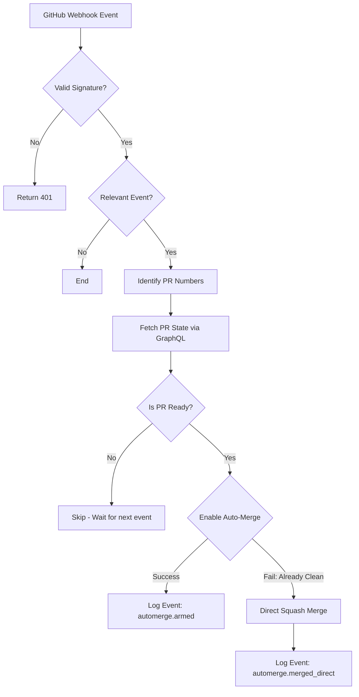

<details>
<summary>Relevant source files</summary>

The following files were used as context for generating this wiki page:

- [worker/src/index.ts](worker/src/index.ts)
- [README.md](README.md)
- [worker/schema.sql](worker/schema.sql)
- [branch-ruleset-template.json](branch-ruleset-template.json)
- [AGENTS.md](AGENTS.md)
- [apply-ruleset.sh](apply-ruleset.sh)
</details>

# Auto-Merge Arming Logic

The **Auto-Merge Arming Logic** is a reactive system within the `ops-hub` worker designed to automate the enabling of GitHub's native auto-merge (squash) feature for Pull Requests. It replaces legacy timer-based cloud routines with an event-driven approach that responds to GitHub webhooks. Its primary purpose is to ensure that PRs that meet specific safety criteria (e.g., green status checks, not in draft, mergeable state) are automatically merged without requiring further manual intervention.

Sources: [README.md:27-30](README.md#L27-L30), [worker/src/index.ts:74-79](worker/src/index.ts#L74-L79)

## System Architecture and Data Flow

The system operates as a subset of the main GitHub webhook handler. When specific events occur on GitHub—such as opening a PR or a status check completing—the worker evaluates if the PR is a candidate for auto-merging.

### Process Flow
1.  **Event Reception**: The worker receives a `POST` request at `/webhook/github`.
2.  **Signature Verification**: The payload is verified using `HMAC-SHA256` with the `GITHUB_WEBHOOK_SECRET`.
3.  **Candidate Identification**: The system identifies relevant PR numbers based on the event type and action.
4.  **Readiness Check**: A GraphQL query fetches the PR's current state (mergeability, draft status, status check rollup).
5.  **Arming/Merging**: If ready, the worker attempts to enable auto-merge or performs a direct squash merge if the PR is already in a "CLEAN" status.

Sources: [worker/src/index.ts:32-52](worker/src/index.ts#L32-L52), [worker/src/index.ts:98-118](worker/src/index.ts#L98-L118), [worker/src/index.ts:121-137](worker/src/index.ts#L121-L137)

### Logic Flow Diagram
The following diagram illustrates the decision-making process for arming auto-merge:



Sources: [worker/src/index.ts:98-118](worker/src/index.ts#L98-L118), [worker/src/index.ts:139-167](worker/src/index.ts#L139-L167)

## Triggering Events and Actions

Auto-merge arming is triggered by specific GitHub actions that signal a change in PR state or build completion.

| Event Type | Actions / Conditions | Reasoning |
| :--- | :--- | :--- |
| `pull_request` | `opened`, `synchronize`, `reopened`, `ready_for_review` | Indicates a new or updated PR is available for evaluation. |
| `check_run` | `action: completed`, `conclusion: success` or `skipped` | Indicates status checks (CI/CD) have finished successfully. |

Sources: [worker/src/index.ts:81-82](worker/src/index.ts#L81-L82), [worker/src/index.ts:100-118](worker/src/index.ts#L100-L118)

### Candidate Lookup Logic
For `check_run` events, the system handles two scenarios for finding the associated PR:
-  **Standard PRs**: Uses the `pull_requests[]` array in the webhook payload.
-  **Fork PRs**: If the array is empty, it queries the GitHub REST API using the `head_sha` to find open PRs.

Sources: [worker/src/index.ts:104-116](worker/src/index.ts#L104-L116)

## Execution Criteria (Readiness)

Before arming auto-merge, the worker validates the PR state via a GraphQL query to the GitHub API. A PR is considered "ready" if it satisfies all of the following conditions:
1.  **State**: Must be `OPEN`.
2.  **Draft Status**: Must not be a draft (`isDraft: false`).
3.  **Current Auto-Merge State**: Auto-merge must not already be enabled (`autoMergeRequest` is null).
4.  **Mergeability**: Must have `mergeStateStatus: "CLEAN"` OR (`mergeable: "MERGEABLE"` AND `statusCheckRollup: "SUCCESS"`).

Sources: [worker/src/index.ts:121-140](worker/src/index.ts#L121-L140)

### Mutation Handling
The system uses two primary mutations via the GitHub GraphQL API:
-  `enablePullRequestAutoMerge`: The primary action to arm the native squash merge.
-  `mergePullRequest`: A fallback used only when the PR is already in "CLEAN" status and GitHub rejects the arming request (Error: "Pull request is in clean status").

Sources: [worker/src/index.ts:143-167](worker/src/index.ts#L143-L167)

## Database Persistence and Logging

All arming outcomes are persisted in the `events` table of the D1 database.

```sql
INSERT INTO events (source, event_type, repo, triggers_coderabbit, payload, received_at)
VALUES ('ops-hub', 'automerge.armed' | 'automerge.merged_direct', ?, 0, ?, unixepoch())
```

Sources: [worker/src/index.ts:168-173](worker/src/index.ts#L168-L173), [worker/schema.sql:3-12](worker/schema.sql#L3-L12)

## Configuration and Security

The auto-merge logic is governed by specific security constraints and configuration requirements.

-  **Authentication**: Uses the `GITHUB_TOKEN` secret, which must be a fine-grained Personal Access Token (PAT) with `pull-requests:write` permissions.
-  **Agent Constraints**: AI agents are forbidden from merging PRs directly; the worker performs this as a system service.
-  **Branch Protection**: The system relies on repo-level rulesets (e.g., `branch-ruleset-template.json`) to enforce status checks (like CodeRabbit) before the merge actually completes.

Sources: [worker/src/index.ts:11-13](worker/src/index.ts#L11-L13), [README.md:65-66](README.md#L65-L66), [AGENTS.md:21](AGENTS.md#L21), [branch-ruleset-template.json:1-35](branch-ruleset-template.json#L1-L35)

## Summary

The Auto-Merge Arming Logic provides a robust, event-driven mechanism for finalizing PRs. By moving from a timer-based system to a reactive webhook-based system, it ensures faster merge times while maintaining strict adherence to mergeability requirements. It gracefully handles GitHub's internal state transitions by providing a direct-merge fallback for clean PRs, ensuring no PR gets "stuck" due to race conditions between status check completion and arming commands.

Sources: [README.md:27-30](README.md#L27-L30), [worker/src/index.ts:74-79](worker/src/index.ts#L74-L79), [worker/src/index.ts:155-165](worker/src/index.ts#L155-L165)
