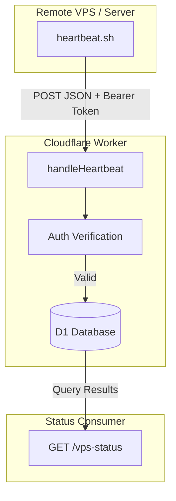
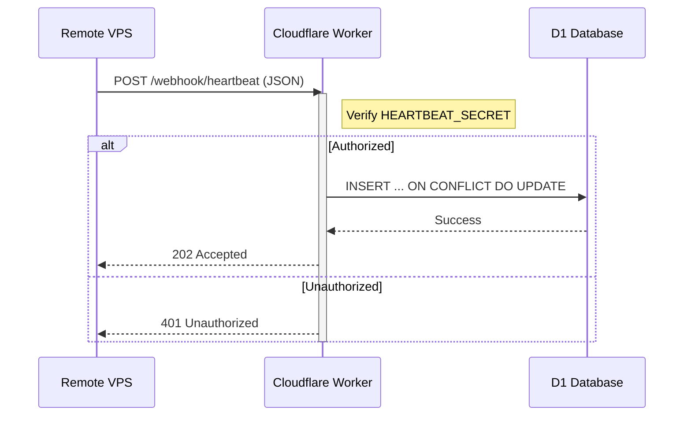

<details>
<summary>Relevant source files</summary>

The following files were used as context for generating this wiki page:

- [worker/src/index.ts](worker/src/index.ts)
- [README.md](README.md)
- [worker/schema.sql](worker/schema.sql)
- [clients/heartbeat.sh](clients/heartbeat.sh)
- [AGENTS.md](AGENTS.md)
- [CLAUDE.md](CLAUDE.md)
</details>

# VPS Heartbeat System

The VPS Heartbeat System is a specialized monitoring module within the `ops-hub` project designed to track the availability and health of Virtual Private Servers (VPS) and other services. It operates on a push-based model where remote clients send periodic "pings" containing status information and system metrics to a central Cloudflare Worker.

Sources: [README.md:14-16](README.md#L14-L16), [AGENTS.md:3-5](AGENTS.md#L3-L5)

The system exposes two primary interfaces: a ingestion endpoint for receiving status updates and a query endpoint for retrieving the last known state of all monitored sources. This ensures that agents or scripts can determine server availability in real-time based on the most recent data stored in the D1 database.

Sources: [README.md:43-46](README.md#L43-L46), [worker/src/index.ts:380-388](worker/src/index.ts#L380-L388)

## System Architecture

The architecture consists of three main layers: the remote clients (shell scripts), the edge processing layer (Cloudflare Worker), and the persistence layer (Cloudflare D1).

### Data Flow Diagram
The following diagram illustrates the lifecycle of a heartbeat from the remote VPS to the monitoring dashboard.



Sources: [worker/src/index.ts:344-388](worker/src/index.ts#L344-L388), [clients/heartbeat.sh:11-16](clients/heartbeat.sh#L11-L16)

### Component Overview

| Component | Description | File Path |
| :--- | :--- | :--- |
| **Ingestion Endpoint** | `POST /webhook/heartbeat` - Receives and validates status payloads. | [worker/src/index.ts:344](worker/src/index.ts#L344) |
| **Query Endpoint** | `GET /vps-status` - Returns a JSON list of all monitored sources. | [worker/src/index.ts:377](worker/src/index.ts#L377) |
| **Client Script** | `heartbeat.sh` - Bash script to gather local metrics and push to the Worker. | [clients/heartbeat.sh](clients/heartbeat.sh) |
| **Persistence** | `heartbeats` Table - D1 table storing source ID, status, and metadata. | [worker/schema.sql:41-47](worker/schema.sql#L41-L47) |

## Ingestion Logic

The system utilizes an "upsert" strategy for heartbeat data. When a new heartbeat is received via the `handleHeartbeat` function, the system either inserts a new record or updates the existing record for that `source_id`.



Sources: [worker/src/index.ts:344-361](worker/src/index.ts#L344-L361)

### Request Validation
The Worker enforces security by checking the `Authorization` header against a `HEARTBEAT_SECRET` stored in the environment variables. The payload must include a `source_id` (e.g., 'mp100') and a `status` string.
Sources: [worker/src/index.ts:345-351](worker/src/index.ts#L345-L351), [README.md:65](README.md#L65)

## Heartbeat Client (`heartbeat.sh`)

The reference client is a lightweight Bash script designed to be run as a cron job (typically every 5 minutes). It collects system metrics using standard Linux utilities and transmits them as a JSON object in the `details` field.

### Collected Metrics
*  **CPU Usage:** Extracted from `top`.
*  **Memory Usage:** Percentage calculated from `free -m`.
*  **Disk Usage:** Percentage of the root partition from `df -h`.

Sources: [clients/heartbeat.sh:8-16](clients/heartbeat.sh#L8-L16), [README.md:88-91](README.md#L88-L91)

```bash
# Example client invocation via cron
*/5 * * * * HEARTBEAT_SECRET=$(cat /path/to/secret) OPS_HUB_URL=https://ops-hub.domain.se /path/to/clients/heartbeat.sh mp100
```

Sources: [README.md:88-91](README.md#L88-L91)

## Data Model

The system stores heartbeat state in the `heartbeats` table within the Cloudflare D1 database.

### Heartbeats Table Schema

| Field | Type | Description |
| :--- | :--- | :--- |
| `source_id` | TEXT (PK) | Unique identifier for the VPS (e.g., 'mp100'). |
| `status` | TEXT | Status string (e.g., 'up', 'down', 'maintenance'). |
| `last_seen` | INTEGER | Unix epoch timestamp of the last received heartbeat. |
| `details` | TEXT | JSON string containing metrics (CPU, RAM, Disk). |

Sources: [worker/schema.sql:41-47](worker/schema.sql#L41-L47)

## Status Retrieval

The `handleVpsStatus` function processes requests to the `/vps-status` endpoint. It enriches the database records by calculating the time elapsed since the last update and parsing the JSON `details` field back into an object for the consumer.

*  **Endpoint:** `GET /vps-status`
*  **Authorization:** Requires `QUERY_SECRET` via Bearer token.
*  **Calculated Fields:** Includes `seconds_since_seen` to allow consumers to detect stale status (i.e., if a VPS has stopped sending heartbeats).

Sources: [worker/src/index.ts:377-388](worker/src/index.ts#L377-L388), [worker/src/index.ts:21-23](worker/src/index.ts#L21-L23)

## Summary

The VPS Heartbeat System provides a centralized, real-time view of infrastructure health by offloading status tracking to the edge. By combining a simple shell-based client with Cloudflare's D1 database and Worker platform, the system ensures that status data is highly available and easily accessible to other automation agents within the `ops-hub` ecosystem.

Sources: [README.md:14-16](README.md#L14-L16), [CLAUDE.md:1-5](CLAUDE.md#L1-L5)
