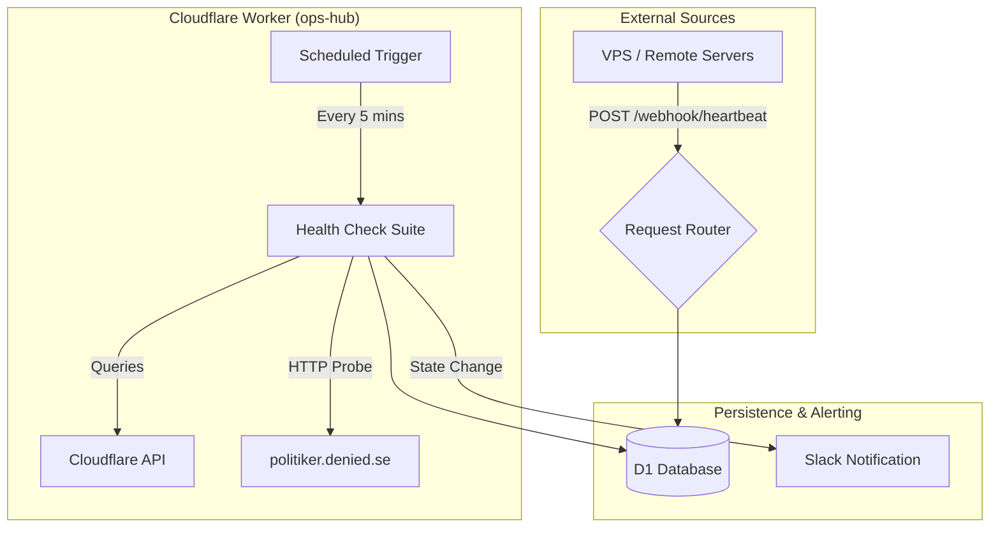
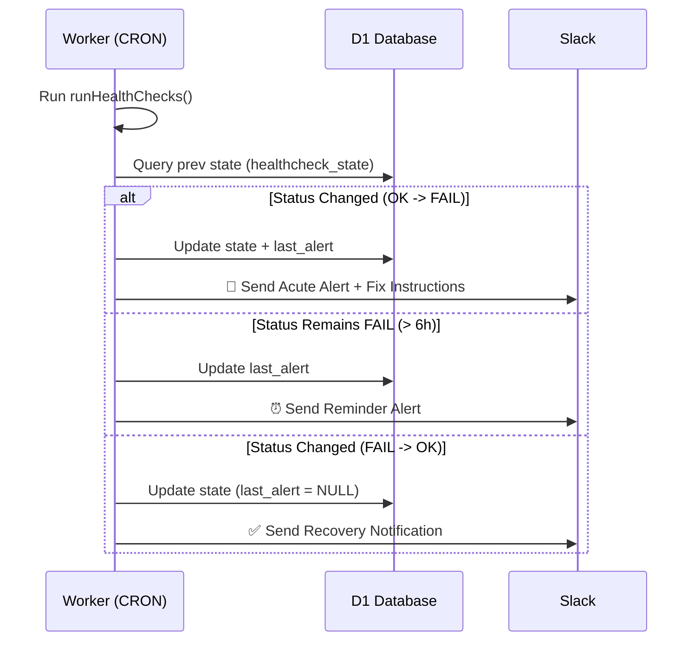

<details>
<summary>Relevant source files</summary>

The following files were used as context for generating this wiki page:

- [worker/src/index.ts](worker/src/index.ts)
- [README.md](README.md)
- [worker/schema.sql](worker/schema.sql)
- [clients/heartbeat.sh](clients/heartbeat.sh)
- [AGENTS.md](AGENTS.md)
</details>

# Service Health Checks

The Service Health Checks system in `ops-hub` is a comprehensive monitoring framework designed to ensure the stability and availability of internal infrastructure and the `politiker.denied.se` web application. It operates through two primary mechanisms: proactive periodic checks executed via Cloudflare Worker CRON triggers and passive "Heartbeat" signals received from external Virtual Private Servers (VPS).

This system centralizes status monitoring, providing real-time visibility into service health and automated alerting via Slack when state transitions occur (e.g., from OK to FAIL). It ensures that critical components such as database availability, domain routing, and script deployments are functioning correctly within the Cloudflare ecosystem.
Sources: [README.md:21-31](README.md#L21-L31), [worker/src/index.ts:517-526](worker/src/index.ts#L517-L526)

## Monitoring Architecture

The architecture relies on a Cloudflare Worker acting as a central hub. It maintains state in a D1 SQL database to track transitions and prevent alert fatigue.



The diagram above illustrates the dual flow of health data: active probing of the `politiker` application and passive receipt of heartbeats from remote servers.
Sources: [README.md:37-46](README.md#L37-L46), [worker/src/index.ts:655-675](worker/src/index.ts#L655-L675)

## Periodic Application Checks

The `runHealthChecks` function executes six specific tests every 5 minutes to validate the `politiker.denied.se` application stack.

### Health Check Definitions

| Check ID | Target | Success Criteria | Failure Recovery Action |
|---|---|---|---|
| `root_200` | Root URL | HTTP 200 response | Check Worker logs and domain routing |
| `api_me_json` | `/api/me` | HTTP 200 + Valid JSON | Verify API service logs |
| `domain_service` | Worker Domain | Points to `politiker-webapp-app` | Correct domain-to-service mapping |
| `scripts_exist` | Workers Scripts | Both `-app` and `-sender` exist | Redeploy missing worker scripts |
| `d1_politicians` | D1 Database | Count >= 1000 records | Restore from latest D1 backup |
| `access_apps` | Zero Trust | `/admin` gated, root public | Correct Cloudflare Access configuration |

Sources: [worker/src/index.ts:444-515](worker/src/index.ts#L444-L515), [README.md:21-27](README.md#L21-L27)

### Alerting Logic and State Management
The system utilizes a transition-based alerting model. Notifications are sent to Slack only when a check moves from OK to FAIL or vice-versa. To prevent silence during prolonged failures, a reminder is sent every 6 hours.



Sources: [worker/src/index.ts:532-581](worker/src/index.ts#L532-L581), [README.md:27-28](README.md#L27-L28)

## VPS Heartbeats

Remote servers report their status via the `POST /webhook/heartbeat` endpoint. This allows `ops-hub` to monitor infrastructure that it cannot directly probe.

### Heartbeat Data Structure
Clients send a JSON payload containing resource utilization metrics. 
Sources: [clients/heartbeat.sh:13-17](clients/heartbeat.sh#L13-L17), [worker/schema.sql:51-56](worker/schema.sql#L51-L56)

```sql
-- Schema for tracking heartbeats
CREATE TABLE heartbeats (
  source_id TEXT PRIMARY KEY,
  status TEXT NOT NULL,
  last_seen INTEGER NOT NULL,
  details TEXT -- JSON: cpu_pct, mem_pct, disk_used
);
```

Sources: [worker/schema.sql:51-56](worker/schema.sql#L51-L56)

### VPS Status Retrieval
Users can query the health of all reporting VPS units via the `/vps-status` endpoint. The response includes the time elapsed since the last signal (calculated as `now - last_seen`).
Sources: [worker/src/index.ts:366-375](worker/src/index.ts#L366-L375), [README.md:52](README.md#L52)

## Implementation Details

### API Endpoints
Endpoints are protected by secret-based Bearer tokens.

*  `POST /webhook/heartbeat`: Receives signals from VPS. Requires `HEARTBEAT_SECRET`.
*  `GET /vps-status`: Returns JSON list of all sources and their metrics. Requires `QUERY_SECRET`.

Sources: [worker/src/index.ts:639-646](worker/src/index.ts#L639-L646), [README.md:48-53](README.md#L48-L53)

### Cloudflare API Integration
The health check suite interacts with the Cloudflare Client V4 API to verify internal configurations (D1, Workers, Access). It uses a dedicated `CF_READONLY_TOKEN` for these operations.
Sources: [worker/src/index.ts:397-407](worker/src/index.ts#L397-L407), [README.md:73-74](README.md#L73-L74)

### Scheduled Tasks (Cron)
The system is orchestrated by the Cloudflare Workers `scheduled` handler:
*  `*/5 * * * *`: Executes the health check suite and processes results.
*  `0 7 * * *`: Sends a daily summary report to Slack, regardless of state changes.

Sources: [worker/src/index.ts:661-666](worker/src/index.ts#L661-L666), [README.md:28-29](README.md#L28-L29)

## Summary
The Service Health Checks system provides a robust monitoring layer for the `ops-hub` infrastructure. By combining active probing of application components with passive heartbeats from remote VPS units, it ensures that administrators are alerted to critical failures immediately while maintaining a historical record of system health in the D1 database.
Sources: [README.md:1-31](README.md#L1-L31), [AGENTS.md:1-5](AGENTS.md#L1-L5)
