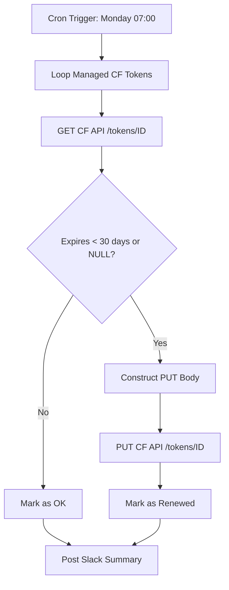
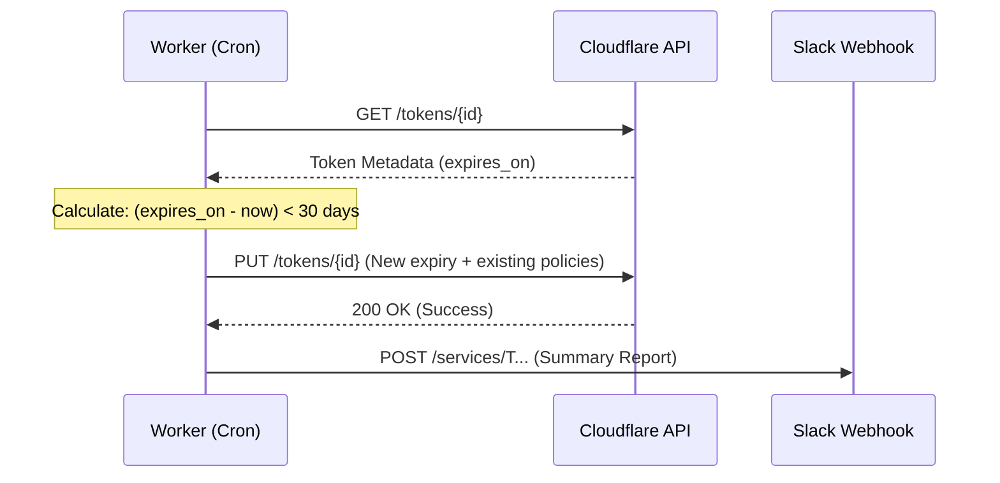

<details>
<summary>Relevant source files</summary>

The following files were used as context for generating this wiki page:

- [worker/src/index.ts](../../worker/src/index.ts)
- [README.md](../../README.md)
- [SECURITY.md](../../SECURITY.md)
- [worker/schema.sql](../../worker/schema.sql)
- [AGENTS.md](../../AGENTS.md)
</details>

# Automated Token Maintenance

Automated Token Maintenance is a critical infrastructure routine within the `ops-hub` project designed to prevent service interruptions caused by expired credentials. It specifically handles the lifecycle of Cloudflare account tokens and monitors the expiration of GitHub Personal Access Tokens (PATs) used by associated web applications.

Sources: [README.md:27-29](README.md#L27-L29), [worker/src/index.ts:392-398](worker/src/index.ts#L392-L398)

## Architecture and Logic

The token maintenance system is implemented as a scheduled task within the Cloudflare Worker. It operates on a weekly cycle, triggered by a cron expression, and interacts with external APIs to verify and update authentication credentials.

### Trigger Mechanism
The routine is executed via a Cloudflare Workers Scheduled Event.
*  **Cron Schedule:** `0 7 * * 1` (Every Monday at 07:00 UTC).
*  **Handler:** The `maintainCfTokens` function is invoked by the `scheduled` handler.

Sources: [worker/src/index.ts:639-641](worker/src/index.ts#L639-L641), [worker/src/index.ts:646](worker/src/index.ts#L646)

### Core Logic Flow
The process follows a strict "check-then-update" pattern for a specific set of managed tokens. It calculates if a token is within its 30-day expiration window or lacks an expiration date entirely. If renewal is required, the system issues a `PUT` request to the Cloudflare API to extend the token's life by exactly one year.

The following flowchart illustrates the decision logic for Cloudflare token renewal:



The diagram shows the iterative process of checking each managed Cloudflare token and renewing it only if it meets the expiration criteria.
Sources: [worker/src/index.ts:408-435](worker/src/index.ts#L408-L435)

## Managed Components

### Cloudflare Tokens
The system manages three specific Cloudflare account tokens. It adheres to strict safety rules: it never deletes tokens, and it must preserve existing security policies (permission arrays) during the update to avoid silent access stripping.

| Label | Token ID | Purpose |
| :--- | :--- | :--- |
| `admin` | `4fc391e14c1126872116b94c56270674` | Full account administration |
| `deploy` | `6ce6b014c5e660147f0ed08e17f4cdd5` | Infrastructure deployment |
| `readonly` | `468c30efcbecfd03b0c664b56b4862bd` | Monitoring and health checks |

Sources: [worker/src/index.ts:400-404](worker/src/index.ts#L400-L404), [worker/src/index.ts:392-398](worker/src/index.ts#L392-L398)

### GitHub PAT Monitoring
The system also monitors the fine-grained Personal Access Token (PAT) used for the `politiker-webapp`. Unlike Cloudflare tokens, this PAT cannot be renewed programmatically and requires manual intervention.
*  **Warning Threshold:** Alerts begin appearing in reports starting `2026-09-07`.
*  **Target Expiry:** Approximately `2026-09-21`.
*  **Action:** Slack notifications include step-by-step instructions for a human operator to regenerate the token and update secrets via the CLI.

Sources: [worker/src/index.ts:408](worker/src/index.ts#L408), [worker/src/index.ts:441-450](worker/src/index.ts#L441-L450)

## Implementation Details

### API Interaction
The maintenance routine uses a specialized helper function, `cfApi`, to communicate with Cloudflare. This helper ensures that requests are authenticated using the `CF_ADMIN_TOKEN` and handles JSON serialization.

```javascript
// worker/src/index.ts:381-390
async function cfApi(token: string, method: string, path: string, body?: unknown): Promise<any> {
  const res = await fetchWithTimeout(`https://api.cloudflare.com/client/v4${path}`, {
    method,
    headers: { authorization: `Bearer ${token}`, "content-type": "application/json" },
    body: body === undefined ? undefined : JSON.stringify(body),
  });
  const json = (await res.json());
  if (!json.success) {
    throw new Error(`CF API ${method} ${path}: HTTP ${res.status} ${JSON.stringify(json.errors ?? [])}`);
  }
  return json.result;
}
```

Sources: [worker/src/index.ts:381-390](worker/src/index.ts#L381-L390)

### Communication Sequence
The following sequence diagram detail the interaction between the Worker, Cloudflare's API, and the Slack notification system:



The sequence shows the retrieval of metadata followed by a conditional update and a final notification to Slack.
Sources: [worker/src/index.ts:408-453](worker/src/index.ts#L408-L453)

## Security and Compliance

The token maintenance system follows established project security policies:
1.  **Secret Management:** Tokens and secrets (like `CF_ADMIN_TOKEN` and `SLACK_WEBHOOK_URL`) are never committed to the repository; they are managed as encrypted environment variables via Wrangler.
2.  **Exclusion Rules:** A specific token ID (`7fe0985e91f909d888690eec40625612`) used for the `mp100` server is explicitly excluded from automated maintenance to prevent unintended side effects on hardware-linked authentication.
3.  **Agent Restrictions:** AI agents are forbidden from modifying secrets or disabling these maintenance workflows.

Sources: [SECURITY.md:57-61](SECURITY.md#L57-L61), [AGENTS.md:12](AGENTS.md#L12), [worker/src/index.ts:394-396](worker/src/index.ts#L394-L396)

## Summary
Automated Token Maintenance provides a proactive layer of security by ensuring that programmatic access remains valid without manual oversight for Cloudflare resources. By integrating a weekly check with a Slack-based warning system for manual credentials (GitHub PATs), the system maintains high availability for the `ops-hub` and its managed services.

Sources: [README.md:27-29](README.md#L27-L29), [worker/src/index.ts:441-453](worker/src/index.ts#L441-L453)
