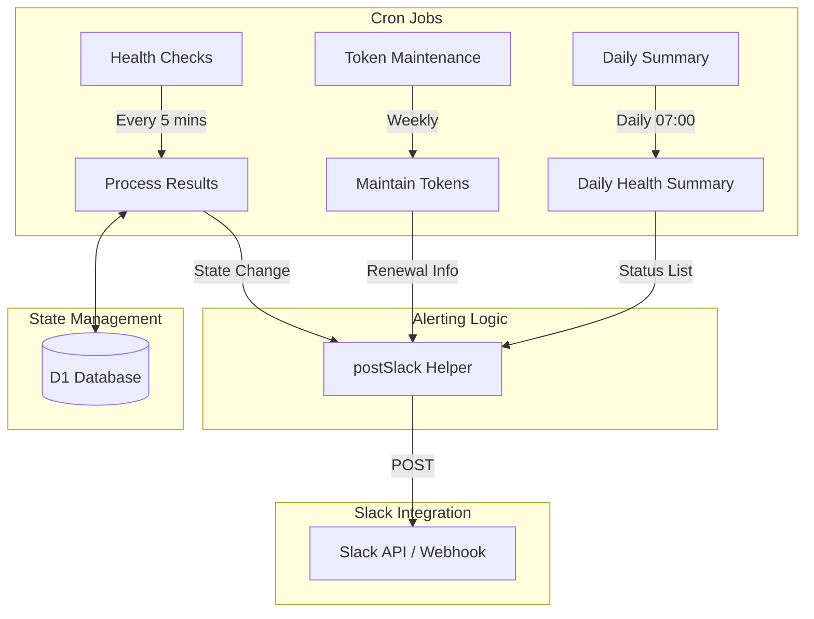
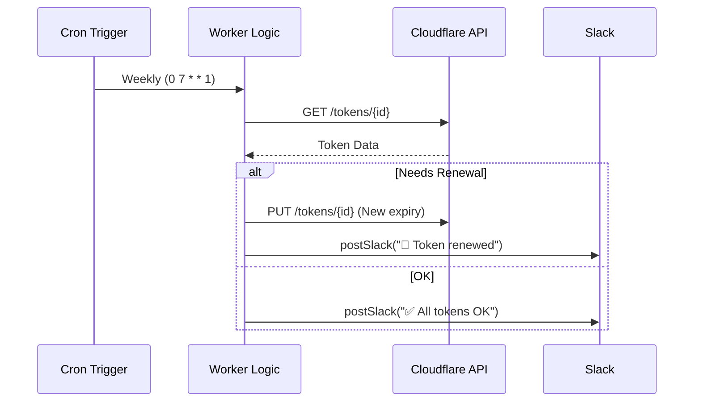

<details>
<summary>Relevant source files</summary>

The following files were used as context for generating this wiki page:

- [worker/src/index.ts](worker/src/index.ts)
- [README.md](README.md)
- [worker/schema.sql](worker/schema.sql)
- [worker/package.json](worker/package.json)
- [AGENTS.md](AGENTS.md)
</details>

# Slack Alerting Flow

The Slack Alerting Flow in `ops-hub` serves as a centralized notification system for infrastructure health monitoring and administrative maintenance tasks. It is designed to be an outgoing-only mechanism, primarily supporting Cloudflare health checks for the `politiker.denied.se` domain and weekly maintenance of Cloudflare account tokens. 

The flow is implemented within a Cloudflare Worker and utilizes D1 for state persistence to ensure that alerts are transition-based, preventing notification fatigue by only signaling when a status changes or after a significant duration of failure.
Sources: [README.md:20-30](README.md#L20-L30), [worker/src/index.ts:511-513](worker/src/index.ts#L511-L513)

## Architecture and Components

The system relies on a central helper function, `postSlack`, which abstracts the delivery of messages to a specific Slack channel. It supports two distinct integration methods: Slack Bot Tokens and Incoming Webhooks.

### Integration Methods
| Method | Configuration Key | Description |
| :--- | :--- | :--- |
| **Slack Bot API** | `SLACK_BOT_TOKEN` | Uses the `chat.postMessage` endpoint. Requires a Bot User OAuth Token. |
| **Incoming Webhook** | `SLACK_WEBHOOK_URL` | Posts a simple JSON payload to a pre-configured webhook URL. |

Sources: [worker/src/index.ts:13-14](worker/src/index.ts#L13-L14), [worker/src/index.ts:517-548](worker/src/index.ts#L517-L548)

### Core Logic Flow
The alerting logic is decoupled from the message delivery to ensure that the core Worker functions remain resilient even if Slack is unreachable.



This diagram shows the transition from scheduled events to the Slack alerting helper, involving state lookups in D1 to determine if an alert is necessary.
Sources: [worker/src/index.ts:805-820](worker/src/index.ts#L805-L820), [worker/src/index.ts:517-548](worker/src/index.ts#L517-L548)

## Health Check Alerting (politiker.denied.se)

Health check alerts are triggered by a cron job running every 5 minutes. To avoid spam, the system uses the `healthcheck_state` table in the D1 database to track the previous state of each check.

### State Transition Logic
Alerts are dispatched under three specific conditions:
1.  **OK to FAIL:** An urgent alert is sent immediately with a suggested fix.
2.  **FAIL to OK:** A recovery notification is sent when a service is restored.
3.  **Ongoing FAIL:** A reminder is sent every 6 hours if a check remains in a failing state.

Sources: [worker/src/index.ts:684-740](worker/src/index.ts#L684-L740), [worker/schema.sql:47-56](worker/schema.sql#L47-L56)

### Database Schema for Alerts
The `healthcheck_state` table persists the necessary metadata for transition logic:

```sql
CREATE TABLE IF NOT EXISTS healthcheck_state (
  check_id TEXT PRIMARY KEY,
  ok INTEGER NOT NULL,           -- 1 = OK, 0 = FAIL
  since INTEGER NOT NULL,        -- unix epoch: status start
  last_alert INTEGER,            -- unix epoch: last Slack alert
  detail TEXT                    -- latest failure/success detail
);
```

Sources: [worker/schema.sql:50-56](worker/schema.sql#L50-L56)

## Token Maintenance and Security Alerts

A weekly maintenance task (`0 7 * * 1`) checks for Cloudflare account tokens that are either missing an expiration date or expiring within 30 days.

### Maintenance Flow
The process performs the following actions:
- **Renewal:** Automatically renews managed tokens for one year and notifies Slack.
- **Warning:** Checks if the fine-grained GitHub PAT (Personal Access Token) for the `politiker-webapp` is approaching its manual renewal date (`2026-09-07`).
- **Notification:** Aggregates all status changes into a single Slack message.

Sources: [worker/src/index.ts:577-630](worker/src/index.ts#L577-L630), [README.md:30-34](README.md#L30-L34)



The sequence above illustrates the automated token renewal and reporting flow.
Sources: [worker/src/index.ts:586-630](worker/src/index.ts#L586-L630)

## Implementation Details

The `postSlack` function is designed to be "best effort." It is wrapped in a try/catch block and never throws an exception, ensuring that the calling process (like a health check or a database update) can complete even if the notification fails.

```typescript
// worker/src/index.ts:517-548
async function postSlack(env: Env, text: string): Promise<{ ok: boolean; ts: string | null }> {
  try {
    if (env.SLACK_BOT_TOKEN) {
      const res = await fetchWithTimeout("https://slack.com/api/chat.postMessage", {
        method: "POST",
        headers: {
          authorization: `Bearer ${env.SLACK_BOT_TOKEN}`,
          "content-type": "application/json",
        },
        body: JSON.stringify({ channel: SLACK_CHANNEL, text }),
      });
      // ... handle response
    }
    // ... handle webhook fallback
  } catch (e) {
    console.warn("slack: post misslyckades:", e);
    return { ok: false, ts: null };
  }
}
```

Sources: [worker/src/index.ts:517-548](worker/src/index.ts#L517-L548)

## Summary
The Slack Alerting Flow provides a robust, state-aware notification layer for `ops-hub`. By combining cron-based checks with D1 state persistence, it ensures that maintainers are alerted to critical infrastructure failures and administrative deadlines without the noise of redundant notifications. The system is extensible, allowing for future webhook sources to be integrated into the same alerting logic.
Sources: [README.md:20-40](README.md#L20-L40), [worker/src/index.ts:805-820](worker/src/index.ts#L805-L820)
