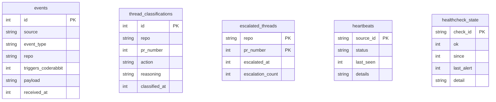
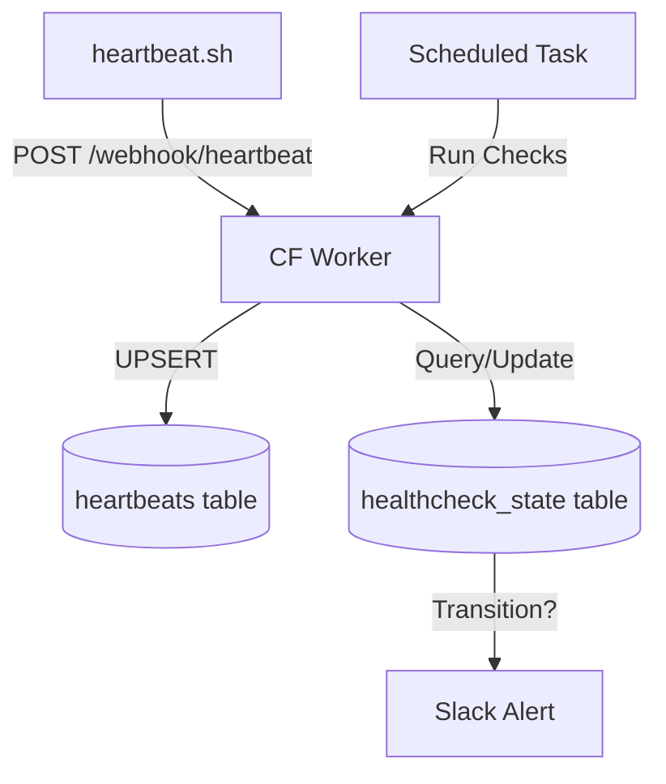

<details>
<summary>Relevant source files</summary>

The following files were used as context for generating this wiki page:

- [worker/schema.sql](../../worker/schema.sql)
- [worker/src/index.ts](../../worker/src/index.ts)
- [README.md](../../README.md)
- [AGENTS.md](../../AGENTS.md)
- [worker/package.json](../../worker/package.json)
- [clients/heartbeat.sh](../../clients/heartbeat.sh)
</details>

# D1 Database Schema

The D1 Database Schema for `ops-hub` serves as the persistence layer for a central Cloudflare Worker node. Its primary purpose is to store event logs from GitHub webhooks, track VPS heartbeat statuses, manage health check states for external services, and log AI-driven triage decisions for CodeRabbit review threads.

This schema enables real-time decision-making, such as calculating CodeRabbit quota usage and managing escalation debouncing for AI agents. By moving from static schedules to a database-backed event model, the system can determine if it is "safe to trigger" actions based on actual activity history rather than fixed time windows.

Sources: [README.md:1-15](README.md#L1-L15), [AGENTS.md:1-10](AGENTS.md#L1-L10)

## Entity Relationship Overview

The database is structured around independent tables that cater to specific operational functions: event logging, server monitoring (heartbeats), and automated maintenance (health checks and AI triage).



*The diagram illustrates the flat structure of the D1 schema, where entities are grouped by functional module rather than complex relational joins.*
Sources: [worker/schema.sql:1-60](worker/schema.sql#L1-L60)

## Core Tables and Data Models

### Events and Quota Tracking
The `events` table captures raw incoming data from webhooks. It is specifically optimized to track events that trigger CodeRabbit reviews to manage API quotas.

| Field | Type | Description |
| :--- | :--- | :--- |
| `id` | INTEGER | Primary Key (Auto-increment). |
| `source` | TEXT | Source of the event (e.g., 'github', 'hostup'). |
| `event_type` | TEXT | Specific action (e.g., 'pull_request.opened'). |
| `triggers_coderabbit` | INTEGER | Boolean flag (1/0) indicating if the event consumes quota. |
| `received_at` | INTEGER | Unix epoch seconds. |

Sources: [worker/schema.sql:3-13](worker/schema.sql#L3-L13), [worker/src/index.ts:340-350](worker/src/index.ts#L340-L350)

### AI Triage and Escalation
These tables manage the state for Workers AI classifications and ensure that `@claude` notifications on GitHub are not sent too frequently.

*  **thread_classifications**: Stores the results of `classifyThread` calls, including the AI's reasoning for actions like `skip`, `autofix`, or `escalate`.
*  **escalated_threads**: Implements a debounce mechanism. It uses a `UNIQUE(repo, pr_number)` constraint to track the `escalation_count`, preventing more than 3 escalations per PR.

Sources: [worker/schema.sql:19-42](worker/schema.sql#L19-L42), [worker/src/index.ts:255-270](worker/src/index.ts#L255-L270)

### Monitoring and Heartbeats
The monitoring tables track the health of both external VPS instances and internal service endpoints.



*The data flow for monitoring: VPS clients push heartbeats while the Worker pulls health check data periodically.*
Sources: [worker/src/index.ts:507-550](worker/src/index.ts#L507-L550), [clients/heartbeat.sh:10-20](clients/heartbeat.sh#L10-L20)

## Implementation Details

### Database Migrations
Migrations are managed via Wrangler. The `package.json` defines scripts for both local and remote execution against the `ops-hub-db` D1 instance.

```json
"scripts": {
  "db:migrate:local": "wrangler d1 execute ops-hub-db --local --file=schema.sql",
  "db:migrate:remote": "wrangler d1 execute ops-hub-db --remote --file=schema.sql"
}
```

Sources: [worker/package.json:5-8](worker/package.json#L5-L8)

### Key Queries
The system relies on specific SQL patterns for atomicity and time-window calculations:

1.  **Quota Calculation**: `SELECT COUNT(*) FROM events WHERE triggers_coderabbit = 1 AND received_at >= ?` uses a rolling 60-minute window.
2.  **Atomic Triage Debounce**: Uses `ON CONFLICT(repo, pr_number) DO UPDATE` with a `WHERE` clause to check `excluded.escalated_at - escalated_threads.escalated_at >= 1800` (30 minutes).

Sources: [worker/src/index.ts:275-285](worker/src/index.ts#L275-L285), [worker/src/index.ts:335-345](worker/src/index.ts#L335-L345)

## Conclusion
The D1 Database Schema is a critical component for the `ops-hub` infrastructure, transforming a stateless Cloudflare Worker into a state-aware operations hub. By centralizing event logs, heartbeat statuses, and AI triage states, it enables sophisticated automation patterns like rate-limited AI escalations and real-time quota management across multiple repositories and servers.
