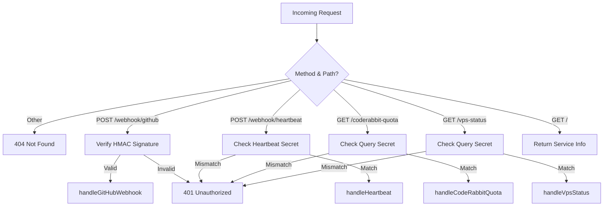
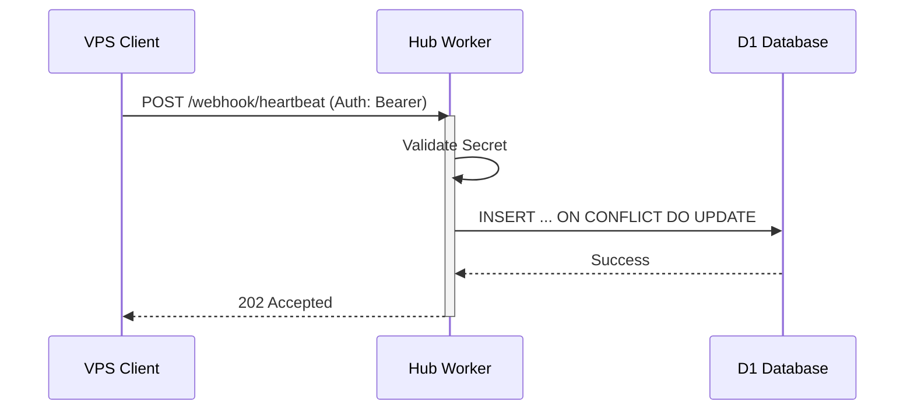

Relevant source files

The following files were used as context for generating this wiki page:

- [worker/src/index.ts](worker/src/index.ts)
- [README.md](README.md)
- [worker/schema.sql](worker/schema.sql)
- [AGENTS.md](AGENTS.md)
- [clients/heartbeat.sh](clients/heartbeat.sh)

# Worker Router & Endpoints

## Introduction
The **Worker Router & Endpoints** system serves as the central hub for the `ops-hub` project, managing incoming data from GitHub webhooks, VPS heartbeats, and external monitoring queries. Built as a Cloudflare Worker, it provides a centralized entry point for automated infrastructure management, including CodeRabbit quota tracking, automated Pull Request (PR) merging, and AI-driven triage of unresolved review threads.

The system acts as a bridge between various services, persisting event data in a D1 database and providing real-time status updates through authenticated endpoints. It handles complex workflows such as security-validated webhook reception, automated Slack notifications for health checks, and scheduled maintenance tasks for Cloudflare API tokens.

Sources: [README.md:1-25](README.md#L1-L25), [worker/src/index.ts:1-20](worker/src/index.ts#L1-L20), [AGENTS.md:1-10](AGENTS.md#L1-L10)

## Request Routing & Authentication
The `route` function in the worker serves as the primary dispatcher, mapping HTTP methods and URL paths to specific handler functions. The worker enforces different authentication mechanisms depending on the endpoint type.

### Routing Logic
The following diagram illustrates the routing and authentication flow for incoming requests:

This flowchart describes the path an incoming request takes through the `route` function and the corresponding authentication checks.
Sources: [worker/src/index.ts:546-577](worker/src/index.ts#L546-L577), [README.md:40-48](README.md#L40-L48)

### Security Protocols
*  **GitHub Webhooks**: Validates requests using HMAC-SHA256 signatures passed in the `X-Hub-Signature-256` header.
*  **Heartbeat/Query Endpoints**: Uses Bearer token authentication against secrets stored in the Worker environment (`HEARTBEAT_SECRET` and `QUERY_SECRET`).
*  **Internal Safety**: Employs `fetchWithTimeout` to prevent hung upstream services from locking worker execution.

Sources: [worker/src/index.ts:25-56](worker/src/index.ts#L25-L56), [worker/src/index.ts:50-58](worker/src/index.ts#L50-L58), [README.md:55-75](README.md#L55-L75)

## Primary API Endpoints

### GitHub Webhook Handler (`POST /webhook/github`)
This endpoint receives events from GitHub (PRs, comments, check runs). It performs several automated actions:
1.  **Event Logging**: Stores the raw payload (truncated) in the `events` table.
2.  **Quota Tracking**: Identifies actions that trigger CodeRabbit reviews (e.g., `pull_request.opened`) to track the 60-minute rolling quota.
3.  **Auto-Merge Arming**: Triggers `maybeArmAutoMerge` for PRs that meet specific criteria (clean status or mergeable with successful checks).
4.  **AI Triage**: For `pull_request_review_thread.unresolved` events, it invokes Workers AI to classify whether the thread requires escalation.

Sources: [worker/src/index.ts:388-420](worker/src/index.ts#L388-L420), [worker/src/index.ts:133-186](worker/src/index.ts#L133-L186), [README.md:10-25](README.md#L10-L25)

### VPS Heartbeat Handler (`POST /webhook/heartbeat`)
Used by external servers to report their status. Clients like `heartbeat.sh` send system metrics (CPU, RAM, Disk) which are stored in the `heartbeats` table via an atomic "check-and-set" logic.

The sequence shows how VPS clients interact with the worker to persist status updates.
Sources: [worker/src/index.ts:422-442](worker/src/index.ts#L422-L442), [clients/heartbeat.sh:1-20](clients/heartbeat.sh#L1-L20)

### Quota and Status Endpoints
| Endpoint | Method | Response Data |
| :--- | :--- | :--- |
| `/coderabbit-quota` | GET | Rolling 60-min window stats: `used`, `limit`, `remaining`, and `safe_to_trigger_now`. |
| `/vps-status` | GET | List of all monitored sources with `last_seen`, `status`, and system `details`. |

Sources: [worker/src/index.ts:444-473](worker/src/index.ts#L444-L473), [README.md:40-48](README.md#L40-L48)

## Data Persistence (D1 Schema)
The system relies on a D1 SQL database to track state across requests.

| Table | Purpose | Key Fields |
| :--- | :--- | :--- |
| `events` | History of all processed webhooks. | `source`, `event_type`, `triggers_coderabbit`, `received_at` |
| `heartbeats` | Latest status of external VPS nodes. | `source_id`, `status`, `last_seen`, `details` |
| `thread_classifications` | AI decisions on PR review threads. | `repo`, `pr_number`, `action`, `reasoning` |
| `escalated_threads` | Debounce and limit logic for AI alerts. | `repo`, `pr_number`, `escalation_count` |
| `healthcheck_state` | State-tracking for site monitoring. | `check_id`, `ok`, `since`, `last_alert` |

Sources: [worker/schema.sql:1-68](worker/schema.sql#L1-L68)

## Scheduled Operations (Cron Jobs)
The worker handles periodic maintenance and monitoring tasks outside of the request/response cycle:
*  **Health Checks (`*/5 * * * *`)**: Monitors `politiker.denied.se` for connectivity, API health, and D1 record counts. Alerts Slack on state transitions.
*  **Daily Summary (`0 7 * * *`)**: Posts a daily status report of all health checks to Slack.
*  **Token Maintenance (`0 7 * * 1`)**: Automatically renews Cloudflare account tokens expiring within 30 days and warns of manual GitHub PAT expiration.

Sources: [worker/src/index.ts:592-612](worker/src/index.ts#L592-L612), [worker/src/index.ts:258-316](worker/src/index.ts#L258-L316), [README.md:26-36](README.md#L26-L36)

## Summary
The Worker Router & Endpoints architecture provides a robust, security-conscious gateway for the `ops-hub`. By combining real-time webhook processing with a D1-backed state machine and scheduled maintenance, it automates complex DevOps tasks like PR management and infrastructure monitoring. The implementation ensures resilience through timeouts, atomic database operations, and multi-tier authentication.

Sources: [worker/src/index.ts:581-615](worker/src/index.ts#L581-L615), [README.md:37-54](README.md#L37-L54)
