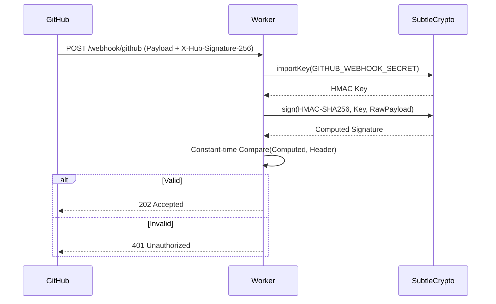
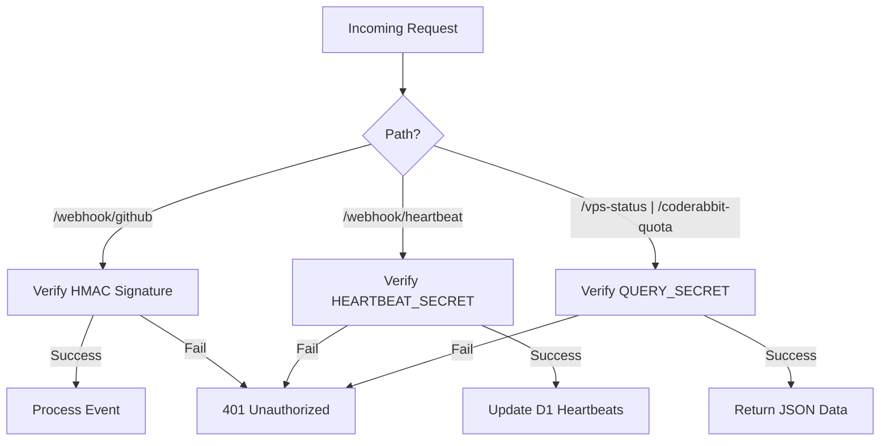

Relevant source files

The following files were used as context for generating this wiki page:

- [worker/src/index.ts](../../worker/src/index.ts)
- [README.md](../../README.md)
- [SECURITY.md](../../SECURITY.md)
- [AGENTS.md](../../AGENTS.md)
- [clients/heartbeat.sh](../../clients/heartbeat.sh)

# Authentication & HMAC Verification

## Introduction
The `ops-hub` system acts as a central node for processing sensitive webhooks from GitHub and status heartbeats from various Virtual Private Servers (VPS). To maintain the integrity and confidentiality of this data, the project implements a multi-tiered authentication strategy. This ensures that incoming events are verified as originating from trusted sources and that status queries are restricted to authorized users or agents.

Sources: [README.md:3-15](README.md#L3-L15), [AGENTS.md:3-8](AGENTS.md#L3-L8)

## HMAC Verification for GitHub Webhooks
The system uses HMAC-SHA256 signatures to verify that incoming requests at the `/webhook/github` endpoint actually originate from GitHub. This prevents spoofing and ensures the payload has not been tampered with.

### The Verification Process
When GitHub sends a webhook, it includes an `X-Hub-Signature-256` header containing the HMAC hex digest of the payload, generated using a shared secret. The `ops-hub` worker performs the following steps:
1.  **Secret Retrieval**: Uses the `GITHUB_WEBHOOK_SECRET` stored in the environment.
2.  **Key Import**: Uses the Web Crypto API to import the raw secret as an HMAC key.
3.  **Signature Generation**: Recomputes the HMAC signature using the raw request body.
4.  **Constant-time Comparison**: Compares the provided signature with the generated one using a bitwise loop to prevent timing attacks.

Sources: [worker/src/index.ts:32-56](worker/src/index.ts#L32-L56), [README.md:43-46](README.md#L43-L46)

### Implementation Logic

The diagram shows the synchronous verification flow within the Worker execution context. 
Sources: [worker/src/index.ts:32-56](worker/src/index.ts#L32-L56), [worker/src/index.ts:258-262](worker/src/index.ts#L258-L262)

## Bearer Token Authentication
For non-GitHub endpoints, such as status queries and VPS heartbeats, the system utilizes static Bearer tokens.

### Internal Query Authorization
The endpoints `/coderabbit-quota` and `/vps-status` require the `QUERY_SECRET`. Verification is handled by the `isAuthorizedQuery` helper function, which checks the `Authorization` header for a matching Bearer token.

Sources: [worker/src/index.ts:18-20](worker/src/index.ts#L18-L20), [README.md:47-50](README.md#L47-L50)

### Heartbeat Authorization
VPS clients, such as `heartbeat.sh`, must provide the `HEARTBEAT_SECRET`. This secret is shared between the worker and the monitoring targets (e.g., mp100 servers).

Sources: [worker/src/index.ts:285-288](worker/src/index.ts#L285-L288), [clients/heartbeat.sh:13-17](clients/heartbeat.sh#L13-L17)

## Summary of Authentication Requirements

| Endpoint | Method | Auth Mechanism | Secret Used |
| :--- | :--- | :--- | :--- |
| `/webhook/github` | POST | HMAC-SHA256 (`X-Hub-Signature-256`) | `GITHUB_WEBHOOK_SECRET` |
| `/webhook/heartbeat` | POST | Bearer Token (`Authorization`) | `HEARTBEAT_SECRET` |
| `/coderabbit-quota` | GET | Bearer Token (`Authorization`) | `QUERY_SECRET` |
| `/vps-status` | GET | Bearer Token (`Authorization`) | `QUERY_SECRET` |

Sources: [README.md:43-50](README.md#L43-L50), [worker/src/index.ts:402-415](worker/src/index.ts#L402-L415)

## Security Configuration & Best Practices
The project enforces strict rules regarding credential management to prevent accidental exposure:
*  **Secrets Storage**: Credentials must be set via `wrangler secret put` and are never committed to the repository.
*  **Constant-time Comparisons**: The `verifyGitHubSignature` function uses a bitwise XOR loop (`diff |= expected.charCodeAt(i) ^ signatureHeader.charCodeAt(i)`) to ensure the comparison time does not reveal information about the key.
*  **Environment Segregation**: Secrets like `GITHUB_TOKEN` (for outgoing GitHub API calls) are scoped to specific repositories rather than the entire account.

Sources: [SECURITY.md:40-45](SECURITY.md#L40-L45), [worker/src/index.ts:54-55](worker/src/index.ts#L54-L55), [README.md:71-75](README.md#L71-L75)

## Request Authentication Flow

This flowchart illustrates the routing logic and the corresponding authentication gate for each endpoint.
Sources: [worker/src/index.ts:402-418](worker/src/index.ts#L402-L418), [worker/src/index.ts:18-20](worker/src/index.ts#L18-L20)

## Outgoing Authentication
While the wiki primarily focuses on incoming verification, the `ops-hub` also manages outgoing authentication for its automated actions:
*  **GitHub API**: Uses `GITHUB_TOKEN` for mutations like auto-merge arming and posting Claude escalation comments.
*  **Cloudflare API**: Uses `CF_ADMIN_TOKEN` and `CF_READONLY_TOKEN` for health checks and token rotation tasks.
*  **Slack Webhooks**: Uses `SLACK_BOT_TOKEN` or `SLACK_WEBHOOK_URL` for status alerts.

Sources: [worker/src/index.ts:77-83](worker/src/index.ts#L77-L83), [worker/src/index.ts:340-345](worker/src/index.ts#L340-L345), [README.md:71-80](README.md#L71-L80)

The authentication and HMAC verification system provides a robust perimeter for the `ops-hub`, ensuring that only valid GitHub events and authenticated service heartbeats can trigger system actions or reveal operational status. By combining HMAC for third-party webhooks and Bearer tokens for internal services, the system balances security with the simplicity required for lightweight Cloudflare Worker deployments.
