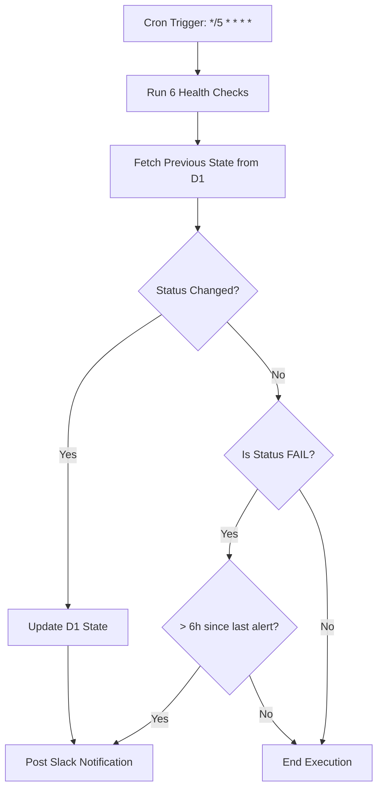
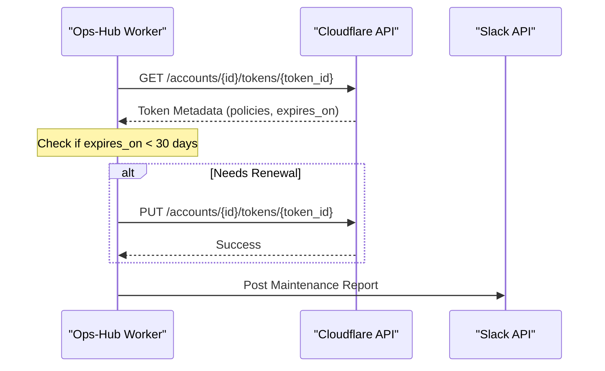

<details>
<summary>Relevant source files</summary>

The following files were used as context for generating this wiki page:

- [worker/src/index.ts](../../worker/src/index.ts)
- [README.md](../../README.md)
- [worker/schema.sql](../../worker/schema.sql)
- [clients/heartbeat.sh](../../clients/heartbeat.sh)
- [worker/package.json](../../worker/package.json)
</details>

# Cron Jobs Configuration

The Cron Jobs Configuration in the `ops-hub` project defines the automated maintenance and monitoring tasks managed by the Cloudflare Worker. These scheduled tasks ensure system health, security through token rotation, and persistent monitoring of external services like VPS instances and web applications.

The scheduling logic is implemented within the `scheduled` handler of the Cloudflare Worker, which dispatches logic based on specific cron expressions. These jobs interact with Cloudflare's D1 database for state persistence and use Slack for alerting and reporting.

Sources: [worker/src/index.ts:707-724](worker/src/index.ts#L707-L724), [README.md:16-24](README.md#L16-L24)

## Scheduled Tasks Overview

The system manages three primary categories of scheduled tasks: high-frequency health checks, daily summaries, and weekly security maintenance.

| Task Name | Cron Expression | Frequency | Purpose |
| :--- | :--- | :--- | :--- |
| **Health Checks** | `*/5 * * * *` | Every 5 minutes | Verifies availability of `politiker.denied.se` services. |
| **Daily Summary** | `0 7 * * *` | Daily at 07:00 | Sends a status report of all health checks to Slack. |
| **Token Maintenance** | `0 7 * * 1` | Weekly (Monday 07:00) | Renews Cloudflare tokens nearing expiration. |

Sources: [worker/src/index.ts:712-721](worker/src/index.ts#L712-L721), [README.md:16-24](README.md#L16-L24)

## Health Monitoring Architecture

The health monitoring system performs six distinct checks against the `politiker.denied.se` infrastructure. It uses a transition-based alerting logic, meaning it only notifies Slack when a status changes (e.g., OK to FAIL) or as a periodic reminder for persistent failures.



The diagram shows the logic flow for the 5-minute health check, illustrating state comparison and alert throttling.
Sources: [worker/src/index.ts:511-628](worker/src/index.ts#L511-L628), [worker/schema.sql:53-62](worker/schema.sql#L53-L62)

### Health Check Components
The following specific checks are executed every 5 minutes:

*  **Root HTTP 200**: Validates the web server response code.
*  **API JSON Integrity**: Ensures `/api/me` returns valid JSON.
*  **Domain Routing**: Checks if the Cloudflare Worker domain points to the correct service.
*  **Script Existence**: Verifies that required Worker scripts are deployed.
*  **D1 Data Volume**: Checks if the `politicians` table contains at least 1000 records.
*  **Access Configuration**: Verifies Zero Trust application rules.

Sources: [worker/src/index.ts:513-575](worker/src/index.ts#L513-L575)

## Token Maintenance System

The weekly maintenance job automatically renews Cloudflare account-scopade tokens. It targets tokens that are either missing an expiration date or are within 30 days of expiring, setting a new expiration date exactly one year in the future.



The sequence shows the interaction between the Worker and Cloudflare API to maintain token validity.
Sources: [worker/src/index.ts:466-509](worker/src/index.ts#L466-L509), [README.md:21-24](README.md#L21-L24)

### Managed Security Assets
The maintenance job specifically manages three Cloudflare tokens:
1.  **admin**: Full account management access.
2.  **deploy**: Permissions for code deployment.
3.  **readonly**: Access for monitoring and health checks.

Additionally, the job monitors a GitHub Fine-Grained Personal Access Token (PAT). Since this cannot be renewed via API, the system issues a Slack warning starting from 2026-09-07 (two weeks before expiration).

Sources: [worker/src/index.ts:462-465](worker/src/index.ts#L462-L465), [worker/src/index.ts:468-470](worker/src/index.ts#L468-L470)

## State Persistence

The cron jobs rely on the `healthcheck_state` table in the D1 database to track status history and prevent alert fatigue.

```sql
CREATE TABLE IF NOT EXISTS healthcheck_state (
  check_id TEXT PRIMARY KEY,
  ok INTEGER NOT NULL,           -- 1 = OK, 0 = FAIL
  since INTEGER NOT NULL,        -- Unix epoch of status start
  last_alert INTEGER,            -- Unix epoch of last Slack alert
  detail TEXT                    -- Descriptive status message
);
```

Sources: [worker/schema.sql:53-62](worker/schema.sql#L53-L62)

## External VPS Heartbeats (Client-Side Cron)

While the Worker manages internal schedules, external VPS instances (like `mp100`) run a client-side cron job to report health back to the hub. This is typically configured to run every 5 minutes.

```bash
*/5 * * * * HEARTBEAT_SECRET=$(cat /path/to/secret) OPS_HUB_URL=https://ops-hub.domain.com /path/to/heartbeat.sh mp100
```

Sources: [clients/heartbeat.sh:1-17](clients/heartbeat.sh#L1-L17), [README.md:91-95](README.md#L91-L95)

## Summary

The cron job configuration in `ops-hub` provides a robust, automated infrastructure for monitoring and security. By leveraging Cloudflare Workers' `scheduled` events, the system maintains high availability for the `politiker.denied.se` domain, automates tedious security token rotations, and provides real-time visibility into the health of various VPS assets through Slack integrations and D1-backed state management.
