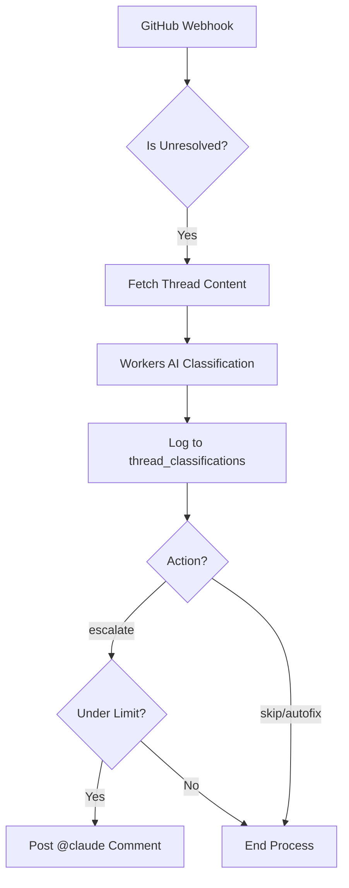
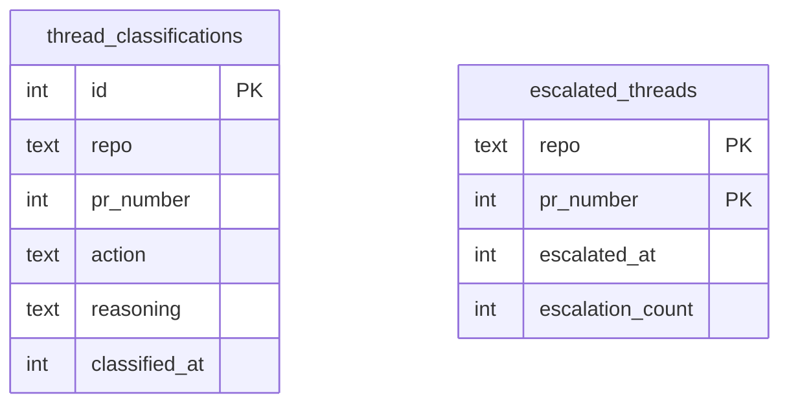

Relevant source files

The following files were used as context for generating this wiki page:

- [worker/src/index.ts](../../worker/src/index.ts)
- [worker/schema.sql](../../worker/schema.sql)
- [README.md](../../README.md)
- [AGENTS.md](../../AGENTS.md)
- [worker/package.json](../../worker/package.json)

# Worker AI Integration

## Introduction

The **Worker AI Integration** within the `ops-hub` project serves as an intelligent triage system for GitHub Pull Request review threads. Specifically, it leverages Cloudflare Workers AI to classify unresolved threads generated by CodeRabbit. The primary goal is to automate the decision-making process for these threads, determining whether they can be ignored, fixed automatically, or if they require human escalation.

By integrating AI directly into the webhook processing flow, the system reduces manual overhead and prevents unnecessary notifications. It acts as a bridge between automated review tools (CodeRabbit) and autonomous agents (Claude), ensuring that only high-priority or ambiguous findings are escalated for further action.

Sources: [README.md:16-24](README.md#L16-L24), [worker/src/index.ts:153-157](worker/src/index.ts#L153-L157)

## AI Triage System

The core of the AI integration is the triage logic triggered by GitHub `pull_request_review_thread` events with an `unresolved` action. The system uses the `@cf/meta/llama-3.1-8b-instruct` model to analyze the content of the review comment.

### Classification Logic
The AI classifies findings into one of three distinct categories:

| Action | Description |
| :--- | :--- |
| **skip** | Trivial or style-related findings with no real risk (e.g., comment formatting). |
| **autofix** | Concrete, mechanical issues that an AI agent can resolve (e.g., missing null checks). |
| **escalate** | Complex findings requiring human or architectural decisions (e.g., security trade-offs). |

Sources: [worker/src/index.ts:161-175](worker/src/index.ts#L161-L175), [worker/schema.sql:20-27](worker/schema.sql#L20-L27)

### Data Flow Diagram
The following diagram illustrates the flow from a GitHub webhook to the AI classification and subsequent escalation.

The system ensures that only the `escalate` action triggers external interaction, while all decisions are logged for audit purposes.

Sources: [worker/src/index.ts:177-200](worker/src/index.ts#L177-L200), [worker/src/index.ts:251-260](worker/src/index.ts#L251-L260)

## Escalation and Safety Mechanisms

To prevent infinite loops and excessive API consumption, the integration includes strict safety boundaries.

### Debouncing and Limits
The system implements a debounce mechanism and a hard limit on escalations per Pull Request. This prevents the "1500kr/6h loop incident" pattern where an AI might repeatedly fail to fix an issue and keep escalating.

*  **Debounce Period**: 30 minutes between escalations for the same PR.
*  **Max Escalations**: 3 total escalations per PR.
*  **Atomic State**: Uses SQL `ON CONFLICT` and `MAX()` functions to ensure atomic check-and-set operations in the D1 database.

Sources: [worker/src/index.ts:153-159](worker/src/index.ts#L153-L159), [worker/src/index.ts:252-270](worker/src/index.ts#L252-L270), [worker/schema.sql:32-38](worker/schema.sql#L32-L38)

### Security and Prompt Injection Prevention
The system is designed to be resilient against prompt injection. The message posted to GitHub is static and does not interpolate raw AI reasoning or untrusted comment bodies. This prevents attackers from manipulating the autonomous Claude agent through malicious code comments.

Sources: [worker/src/index.ts:203-215](worker/src/index.ts#L203-L215)

## Implementation Details

### Key Functions
*  `classifyThread(env, commentBody)`: Wraps the `env.AI.run` call with a specific prompt template and JSON output parsing.
*  `handleUnresolvedThread(env, body)`: Orchestrates the classification, database logging, and escalation logic.
*  `postClaudeEscalationComment(env, repo, prNumber)`: Handles the GitHub API call to post the `@claude` trigger.

Sources: [worker/src/index.ts:177-200](worker/src/index.ts#L177-L200), [worker/src/index.ts:230-248](worker/src/index.ts#L230-L248)

### Database Schema (D1)
The system relies on two primary tables for AI operations:

*  `thread_classifications`: Stores the AI's reasoning and final action for every processed thread.
*  `escalated_threads`: Tracks the count and timing of escalations to enforce rate limits.

Sources: [worker/schema.sql:16-38](worker/schema.sql#L16-L38)

## Conclusion
The Worker AI Integration provides an intelligent filter for automated reviews, ensuring that human-like attention is only requested when truly necessary. By combining LLM-based classification with robust database-driven rate limiting and security-conscious communication patterns, it creates a reliable infrastructure for autonomous project management.

Sources: [README.md:16-24](README.md#L16-L24), [worker/src/index.ts:203-220](worker/src/index.ts#L203-L220)
