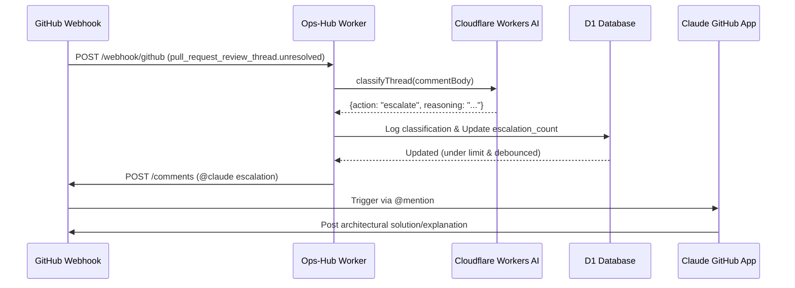
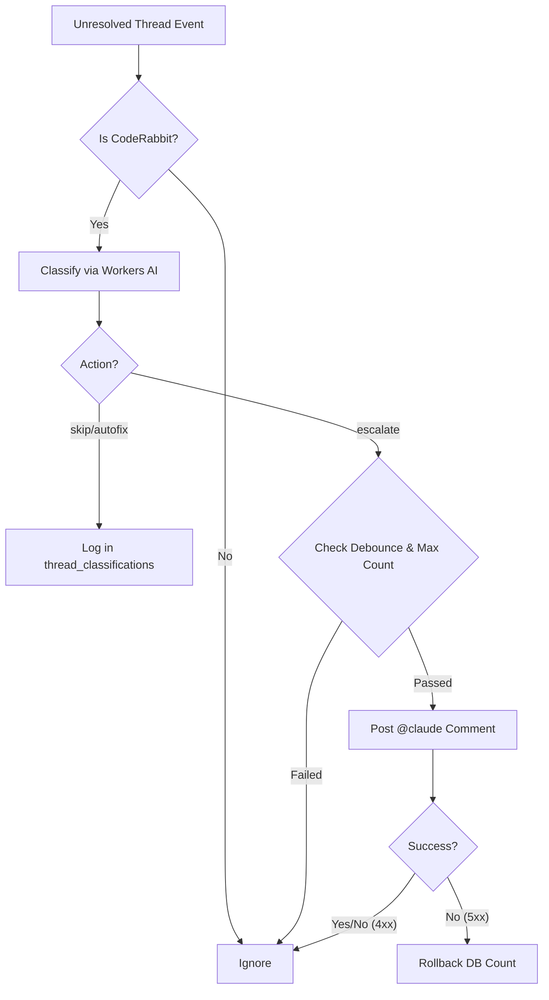

<details>
<summary>Relevant source files</summary>

The following files were used as context for generating this wiki page:

- [worker/src/index.ts](worker/src/index.ts)
- [README.md](README.md)
- [CLAUDE.md](CLAUDE.md)
- [worker/schema.sql](worker/schema.sql)
- [AGENTS.md](AGENTS.md)
- [branch-ruleset-template.json](branch-ruleset-template.json)
</details>

# Claude App Collaboration Pattern

The Claude App Collaboration Pattern is a specialized autonomous workflow within the `ops-hub` project designed to triage and resolve code review findings. It integrates GitHub Webhooks, Cloudflare Workers AI, and the Claude GitHub App to handle unresolved review threads generated by CodeRabbit. Instead of relying on manual intervention or external notification platforms like Slack for every finding, the system uses AI to determine if a finding is trivial, mechanical, or requires complex architectural reasoning.

When a finding is classified as requiring architectural insight, the system "escalates" it by posting a targeted `@claude` comment on the Pull Request. The pre-installed Claude GitHub App then picks up this mention autonomously to propose solutions or explain the findings, creating a closed-loop AI-to-AI collaboration.

Sources: [README.md:16-24](README.md#L16-L24), [worker/src/index.ts:187-195](worker/src/index.ts#L187-L195)

## Architecture and Data Flow

The pattern follows a reactive model triggered by GitHub's `pull_request_review_thread` event with the action `unresolved`. The Cloudflare Worker processes these events, performs classification, and interacts with both the D1 database and the GitHub API.

### High-Level Workflow
1. **Trigger**: A CodeRabbit review thread is marked as unresolved.
2. **Classification**: The Worker uses `classifyThread` with Cloudflare Workers AI (`@cf/meta/llama-3.1-8b-instruct`) to categorize the thread.
3. **State Management**: The classification is logged in the `thread_classifications` table.
4. **Escalation Logic**: If classification is `escalate`, the system checks the `escalated_threads` table for debounce and limits.
5. **Execution**: A comment tagging `@claude` is posted to the GitHub PR.

The following diagram illustrates the sequence of events from a GitHub webhook trigger to the final AI collaboration.



Sources: [worker/src/index.ts:167-175](worker/src/index.ts#L167-L175), [worker/src/index.ts:245-283](worker/src/index.ts#L245-L283), [worker/schema.sql:19-41](worker/schema.sql#L19-L41)

## AI Triage Logic

The core intelligence of the pattern resides in the `classifyThread` function. It uses a specific prompt to categorize CodeRabbit findings into three actionable states.

### Classification Actions

| Action | Description | Scope |
| :--- | :--- | :--- |
| `skip` | Trivial or stylistic findings. | Dependency-pinning style, comment formats, etc. |
| `autofix` | Mechanical/concrete findings. | Missing error handling, null checks, string comparisons. |
| `escalate` | Architectural/Complex findings. | Security trade-offs, breaking changes, business logic. |

Sources: [worker/src/index.ts:197-211](worker/src/index.ts#L197-L211), [worker/schema.sql:26-28](worker/schema.sql#L26-L28)

### Security and Prompt Injection Prevention
The escalation comments posted to GitHub are deliberately static. Neither the raw CodeRabbit text nor the AI's reasoning is interpolated into the final escalation comment. This prevents **Prompt Injection (CWE-1427)**, as the Claude GitHub App reads the context directly from the PR's unresolved threads rather than relying on the data passed in the mention.

Sources: [worker/src/index.ts:241-255](worker/src/index.ts#L241-L255)

## Control and Safety Mechanisms

To prevent infinite loops or excessive API costs (such as a situation where an AI fix doesn't work and the thread remains unresolved), the pattern implements strict safety limits managed through the D1 database.

### Escalation Constraints
* **Max Escalations**: Limited to **3** escalations per Pull Request (`MAX_ESCALATIONS_PER_PR`). After this limit, the PR is left for manual human review.
* **Debounce Window**: Escalations are restricted to once every **30 minutes** (`ESCALATION_DEBOUNCE_SECONDS`) per PR to avoid spamming the Claude App during rapid updates.
* **Retry Logic**: The system distinguishes between transient (retryable) and permanent (non-retryable) errors. Transient network failures (5xx) result in a database rollback of the escalation count, while permanent errors (4xx) increment the count to prevent endless retries on broken configurations.



Sources: [worker/src/index.ts:187-195](worker/src/index.ts#L187-L195), [worker/src/index.ts:257-285](worker/src/index.ts#L257-L285), [worker/schema.sql:33-41](worker/schema.sql#L33-L41)

## Data Models

The pattern relies on two primary tables in the D1 database for logging and state management.

### `thread_classifications`
Logs every classification decision for auditing and prompt tuning.
* `repo` (TEXT): The repository name.
* `pr_number` (INTEGER): The PR identifier.
* `action` (TEXT): skip, autofix, or escalate.
* `reasoning` (TEXT): Truncated AI justification.

### `escalated_threads`
Maintains state for the debounce and limit mechanisms.
* `repo` (TEXT): Repository identifier.
* `pr_number` (INTEGER): PR identifier.
* `escalated_at` (INTEGER): Timestamp of last escalation.
* `escalation_count` (INTEGER): Number of times Claude has been summoned for this PR.

Sources: [worker/schema.sql:19-41](worker/schema.sql#L19-L41)

## Implementation Example: Escalation Trigger

The following logic demonstrates the atomic "check-and-set" mechanism used to prevent race conditions during simultaneous webhook deliveries.

```typescript
// worker/src/index.ts:269-274
const result = await env.DB.prepare(
  `INSERT INTO escalated_threads (repo, pr_number, escalated_at, escalation_count) VALUES (?, ?, unixepoch(), 1)
   ON CONFLICT(repo, pr_number) DO UPDATE SET escalated_at = excluded.escalated_at, escalation_count = escalated_threads.escalation_count + 1
   WHERE excluded.escalated_at - escalated_threads.escalated_at >= ? AND escalated_threads.escalation_count < ?`
)
  .bind(repo, prNumber, ESCALATION_DEBOUNCE_SECONDS, MAX_ESCALATIONS_PER_PR)
  .run();
```

Sources: [worker/src/index.ts:269-274](worker/src/index.ts#L269-L274)

The Claude App Collaboration Pattern ensures that the repository remains under the desired review standard (as defined in `branch-ruleset-template.json`) while automating the resolution of non-trivial code quality findings through intelligent escalation.

Sources: [branch-ruleset-template.json:1-30](branch-ruleset-template.json#L1-L30), [README.md:16-24](README.md#L16-L24)
