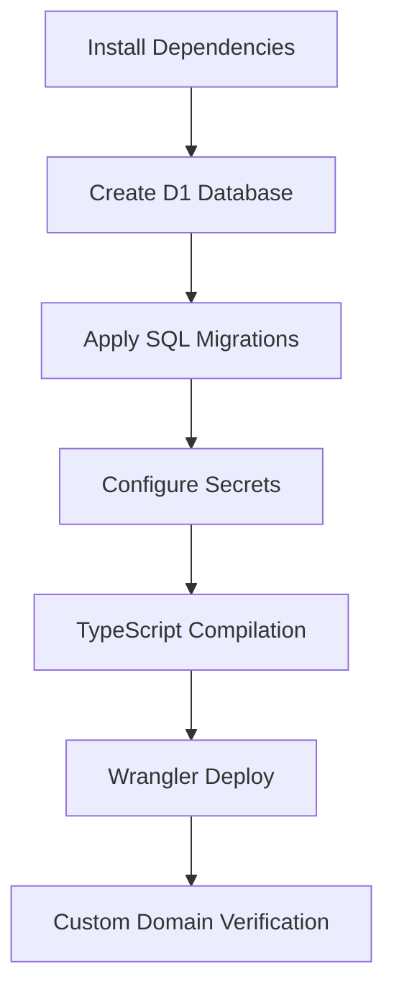
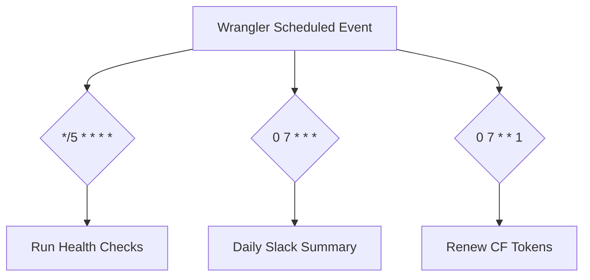

<details>
<summary>Relevant source files</summary>

The following files were used as context for generating this wiki page:

- [README.md](../../README.md)
- [worker/package.json](../../worker/package.json)
- [worker/src/index.ts](../../worker/src/index.ts)
- [worker/schema.sql](../../worker/schema.sql)
- [worker/tsconfig.json](../../worker/tsconfig.json)
- [AGENTS.md](../../AGENTS.md)
</details>

# Cloudflare Wrangler Deployment

The Cloudflare Wrangler Deployment system for **ops-hub** facilitates the management and hosting of a central hub for webhooks, notifications, and monitoring tools. This system leverages the Cloudflare Workers platform, utilizing D1 databases for persistent storage and Workers AI for triage tasks. The deployment is orchestrated primarily through the `wrangler` CLI, ensuring that all infrastructure—including database schemas, secrets, and worker logic—is synchronized across local and production environments.

Sources: [README.md:1-15](README.md#L1-L15), [AGENTS.md:1-5](AGENTS.md#L1-L5), [worker/src/index.ts:1-15](worker/src/index.ts#L1-L15)

## Deployment Lifecycle

The deployment process follows a standard development-to-production workflow using npm scripts and the Wrangler CLI. The project is structured with a TypeScript source in `worker/src/index.ts` and a SQL schema in `worker/schema.sql` for the D1 database.

### Core Scripts
The `worker/package.json` file defines the primary commands used during the lifecycle of the application:

| Command | Action |
| :--- | :--- |
| `npm run dev` | Starts a local development server using `wrangler dev`. |
| `npm run deploy` | Deploys the worker to the Cloudflare network via `wrangler deploy`. |
| `npm run db:migrate:local` | Executes `schema.sql` against a local D1 instance. |
| `npm run db:migrate:remote` | Executes `schema.sql` against the remote production D1 instance. |

Sources: [worker/package.json:4-9](worker/package.json#L4-L9), [AGENTS.md:10-11](AGENTS.md#L10-L11)

### Deployment Flow Diagram
The following diagram illustrates the sequence of actions required to move the application from a clean state to a fully deployed environment:



Sources: [README.md:65-80](README.md#L65-L80), [worker/package.json:11-16](worker/package.json#L11-L16)

## Infrastructure Configuration

### Database Setup
The application requires a Cloudflare D1 database named `ops-hub-db`. After creation, the `database_id` must be manually updated in the `wrangler.jsonc` configuration file. The schema includes tables for `events`, `heartbeats`, `healthcheck_state`, `thread_classifications`, and `escalated_threads`.

Sources: [README.md:67-68](README.md#L67-L68), [worker/schema.sql:1-65](worker/schema.sql#L1-L65)

### Secret Management
Security is handled through `wrangler secret put` commands. These secrets are vital for authenticating incoming webhooks and interacting with external APIs (GitHub, Slack, Cloudflare).

| Secret Key | Purpose |
| :--- | :--- |
| `GITHUB_WEBHOOK_SECRET` | Validates HMAC-SHA256 signatures from GitHub. |
| `HEARTBEAT_SECRET` | Authenticates status updates from VPS clients. |
| `QUERY_SECRET` | Authorizes access to `/coderabbit-quota` and `/vps-status`. |
| `GITHUB_TOKEN` | Fine-grained PAT for PR mutations and Claude escalations. |
| `CF_ADMIN_TOKEN` | Allows the worker to renew other Cloudflare account tokens. |
| `CF_READONLY_TOKEN` | Provides read access for health check routines. |

Sources: [README.md:69-76](README.md#L69-L76), [worker/src/index.ts:3-16](worker/src/index.ts#L3-L16)

## Network and Routing

A critical requirement for deployment is the use of a **Custom Domain**. Standard `workers.dev` domains are blocked by Cloudflare's own bot protection, preventing incoming webhooks from reaching the worker logic. The configuration in `wrangler.jsonc` must specify a custom domain pattern.

```jsonc
// Example configuration in wrangler.jsonc
{
  "routes": [
    { "pattern": "ops-hub.example.com", "custom_domain": true }
  ]
}
```

Sources: [README.md:77-78](README.md#L77-L78)

## Scheduled Tasks (Crons)

The deployment includes several automated tasks handled by the `scheduled` event listener in the worker. These are configured via cron expressions in the deployment manifest.



Sources: [worker/src/index.ts:586-602](worker/src/index.ts#L586-L602), [README.md:37-47](README.md#L37-L47)

## Development Environment
The project uses TypeScript with the `ES2022` target. The configuration ensures strict type checking and proper resolution for Cloudflare Worker types.

### Configuration Snippet

```json
// worker/tsconfig.json
{
  "compilerOptions": {
    "target": "ES2022",
    "module": "ES2022",
    "moduleResolution": "Bundler",
    "strict": true,
    "types": ["@cloudflare/workers-types"]
  }
}
```

Sources: [worker/tsconfig.json:1-11](worker/tsconfig.json#L1-L11)

## Conclusion
The Cloudflare Wrangler Deployment for ops-hub provides a robust, serverless architecture for operations monitoring. By utilizing `wrangler` for secret management, D1 migrations, and script deployment, the system maintains a consistent environment. The transition from local development to production is managed through a structured set of npm scripts, ensuring that all components, including AI-driven triage and automated health checks, are deployed correctly.

Sources: [README.md:55-63](README.md#L55-L63), [AGENTS.md:8-15](AGENTS.md#L8-L15)
