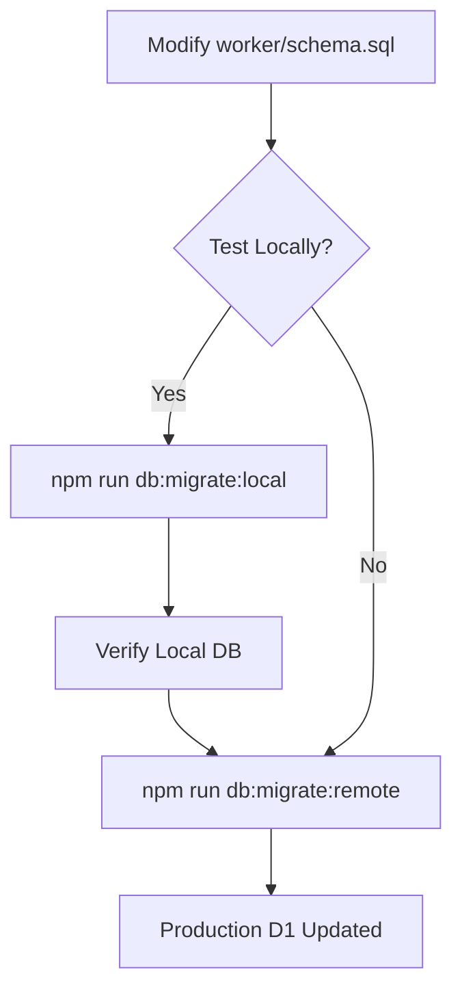
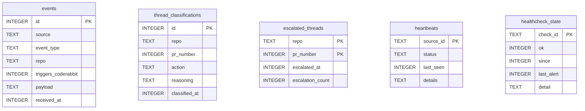

<details>
<summary>Relevant source files</summary>

The following files were used as context for generating this wiki page:

- [worker/schema.sql](../../worker/schema.sql)
- [worker/package.json](../../worker/package.json)
- [README.md](../../README.md)
- [worker/src/index.ts](../../worker/src/index.ts)
- [AGENTS.md](../../AGENTS.md)
- [CLAUDE.md](../../CLAUDE.md)
</details>

# Database Migrations

The database migration system in the **ops-hub** project is designed to manage the schema for its central Cloudflare D1 database. This database stores critical operational data, including GitHub webhook events, VPS heartbeat statuses, AI-driven thread classifications, and health check states for external services.

The migration process is primarily driven by the `worker/schema.sql` file, which contains the authoritative definition of the database structure. Migrations are applied using the Cloudflare `wrangler` CLI tool, which executes the SQL definitions against either a local development database or the production remote D1 instance.

Sources: [README.md:12-25](README.md#L12-L25), [AGENTS.md:9-10](AGENTS.md#L9-L10), [CLAUDE.md:8-9](CLAUDE.md#L8-L9)

## Migration Workflow and Execution

Database changes follow a strict "Schema-first" convention where any modifications to the data structure must be reflected in `worker/schema.sql`. The project utilizes `npm` scripts defined in `worker/package.json` to automate the execution of these SQL files via `wrangler`.

### Execution Steps
1.  **Modify Schema:** Update the SQL definitions in `worker/schema.sql`.
2.  **Local Testing:** Run the migration against a local D1 instance to verify syntax and behavior.
3.  **Deployment:** Execute the migration against the remote production database.

This diagram illustrates the flow of applying a schema change to the production environment:



The diagram shows the transition from modifying the SQL source to local verification and final remote deployment.

Sources: [worker/package.json:6-7](worker/package.json#L6-L7), [AGENTS.md:10](AGENTS.md#L10), [README.md:100-104](README.md#L100-L104)

### Management Commands
The following table summarizes the primary commands used to manage migrations:

| Command | Purpose | Underlying Operation |
| :--- | :--- | :--- |
| `npm run db:migrate:local` | Applies schema to local D1 | `wrangler d1 execute ops-hub-db --local --file=schema.sql` |
| `npm run db:migrate:remote` | Applies schema to production D1 | `wrangler d1 execute ops-hub-db --remote --file=schema.sql` |

Sources: [worker/package.json:6-7](worker/package.json#L6-L7)

## Data Architecture and Schema Definition

The schema is composed of five specialized tables that support different modules of the worker.



This ER diagram shows the non-relational, flat structure of the five primary tables used for event logging, monitoring, and state tracking.

Sources: [worker/schema.sql:3-56](worker/schema.sql#L3-L56)

### Core Tables Detail

#### 1. Events Table
Logs the raw flow of incoming webhooks. It includes a specific field `triggers_coderabbit` to track events that count towards the CodeRabbit review quota (typically 5 reviews per hour).
*  **Indexes:** Optimized for querying events by `received_at` and filtering for CodeRabbit-triggering events.

#### 2. AI Triage Tables
Used by the AI Triage system to classify unresolved CodeRabbit threads.
*  **`thread_classifications`**: Stores the AI's logic (reasoning) and the resulting action (`skip`, `autofix`, or `escalate`).
*  **`escalated_threads`**: Acts as a debounce mechanism to prevent spamming `@claude` comments, limiting escalations to 3 per PR with a 30-minute cooldown.

#### 3. Monitoring Tables
*  **`heartbeats`**: Tracks the "last seen" time and status (`up`, `down`, etc.) for VPS clients like `mp100`.
*  **`healthcheck_state`**: Maintains the status of health checks for `politiker.denied.se`. It uses `since` and `last_alert` (Unix epoch) to calculate durations for transition-based alerting in Slack.

Sources: [worker/schema.sql:3-56](worker/schema.sql#L3-L56), [worker/src/index.ts:167-175](worker/src/index.ts#L167-L175), [README.md:27-38](README.md#L27-L38)

## Integration with Application Logic

The Cloudflare Worker implementation in `worker/src/index.ts` interacts with these tables using SQL bindings. It uses `ON CONFLICT` clauses for idempotency and atomic "check-and-set" operations to prevent race conditions during thread escalation.

### SQL Implementation Snippets

**Atomic Escalation Check:**

```sql
INSERT INTO escalated_threads (repo, pr_number, escalated_at, escalation_count) 
VALUES (?, ?, unixepoch(), 1)
ON CONFLICT(repo, pr_number) DO UPDATE SET 
  escalated_at = excluded.escalated_at, 
  escalation_count = escalated_threads.escalation_count + 1
WHERE excluded.escalated_at - escalated_threads.escalated_at >= ? 
  AND escalated_threads.escalation_count < ?
```

This logic ensures that a PR is only escalated if the debounce period has passed and the max count has not been reached.

Sources: [worker/src/index.ts:311-316](worker/src/index.ts#L311-L316)

**Heartbeat Upsert:**

```sql
INSERT INTO heartbeats (source_id, status, last_seen, details)
VALUES (?, ?, unixepoch(), ?)
ON CONFLICT(source_id) DO UPDATE SET 
  status = excluded.status, 
  last_seen = excluded.last_seen, 
  details = excluded.details
```

Sources: [worker/src/index.ts:365-369](worker/src/index.ts#L365-L369)

## Conclusion
The database migration system in `ops-hub` is a lightweight, SQL-centric approach tailored for Cloudflare D1. By centralizing the schema in `worker/schema.sql` and providing explicit `npm` scripts for local and remote execution, the project maintains high technical accuracy and consistency across its monitoring and automation features.
