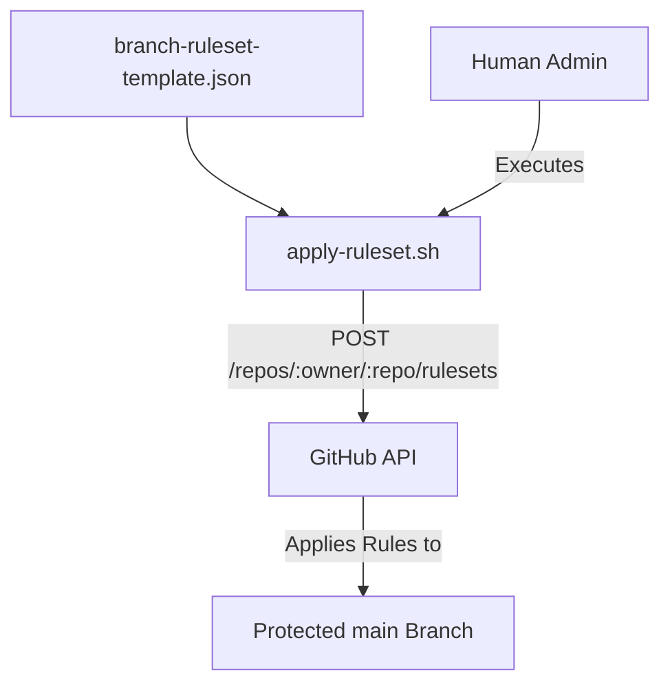
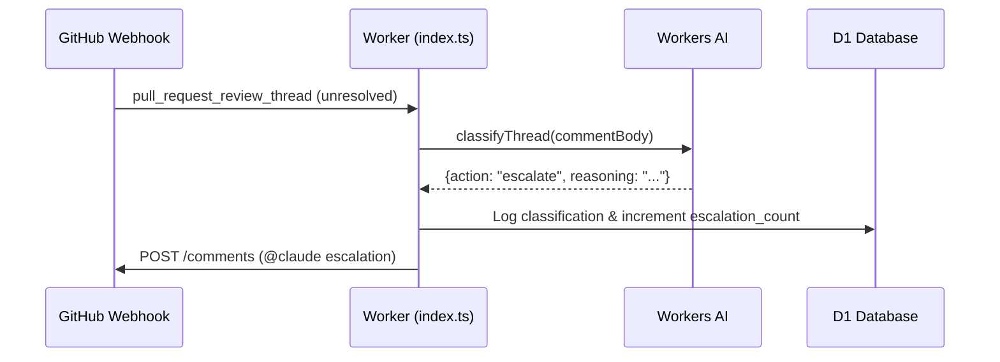

Relevant source files

The following files were used as context for generating this wiki page:

- [apply-ruleset.sh](apply-ruleset.sh)
- [branch-ruleset-template.json](branch-ruleset-template.json)
- [worker/src/index.ts](worker/src/index.ts)
- [README.md](README.md)
- [AGENTS.md](AGENTS.md)
- [worker/schema.sql](worker/schema.sql)

# GitHub Repository Configuration

GitHub Repository Configuration within the `ops-hub` project encompasses the standardized rules, automated enforcement mechanisms, and administrative constraints applied across repositories in the `blixten85` account. Its primary purpose is to ensure consistent branch protection, automated merge workflows, and secure agent interactions without requiring manual per-repo overhead.

The configuration is driven by a combination of JSON-based ruleset templates, shell scripts for deployment, and a central Cloudflare Worker that handles real-time events to enforce behaviors like auto-merge arming and AI-driven triage.
Sources: [README.md:1-55](README.md#L1-L55), [AGENTS.md:1-25](AGENTS.md#L1-L25)

## Branch Protection and Rulesets

The project utilizes GitHub Rulesets to enforce protection on the `main` branch across all managed repositories. These rulesets are standardized via a template that mandates specific review behaviors and status checks.

### Ruleset Template Configuration
The `branch-ruleset-template.json` defines the following constraints for the `main` branch:
*  **Pull Request Requirements**: Requires a pull request before merging, with mandatory resolution of review threads.
*  **Status Checks**: Specifically enforces the "CodeRabbit" status check (Integration ID: 347564).
*  **Strict Enforcement**: Disallows non-fast-forward pushes and branch deletions.
Sources: [branch-ruleset-template.json:1-42](branch-ruleset-template.json#L1-L42)

### Automated Deployment
The `apply-ruleset.sh` script automates the application of these rulesets to new repositories. Due to security constraints, this script is intended for manual execution by a human administrator rather than an AI agent, as branch protection changes are classified as high-privilege operations.
Sources: [apply-ruleset.sh:1-12](apply-ruleset.sh#L1-L12), [AGENTS.md:18-25](AGENTS.md#L18-L25)

The diagram above shows the manual flow for applying the standardized protection rules to a GitHub repository.
Sources: [apply-ruleset.sh:9-10](apply-ruleset.sh#L9-L10)

## Automated Triage and Merge Workflows

The system leverages the `ops-hub` worker to react to GitHub webhooks, automating repository maintenance tasks that would otherwise require manual intervention.

### Auto-Merge Arming
The worker monitors `pull_request` and `check_run` events to arm GitHub's native auto-merge (squash) feature. A PR is armed if it is "CLEAN" or "MERGEABLE" with successful status checks. If GitHub rejects arming due to a "CLEAN" status already being met, the worker executes a direct squash merge as a fallback.
Sources: [worker/src/index.ts:71-158](worker/src/index.ts#L71-L158), [README.md:20-23](README.md#L20-L23)

### AI-Driven Review Triage
When a CodeRabbit review thread is marked as `unresolved`, the system uses Workers AI (`llama-3.1-8b-instruct`) to classify the issue into one of three actions:
*  **skip**: Trivial findings.
*  **autofix**: Mechanically fixable findings.
*  **escalate**: Findings requiring human/architectural decisions.
Sources: [worker/src/index.ts:184-222](worker/src/index.ts#L184-L222), [worker/schema.sql:18-28](worker/schema.sql#L18-L28)

This sequence illustrates the flow from a GitHub event to an AI-powered escalation comment.
Sources: [worker/src/index.ts:258-293](worker/src/index.ts#L258-L293)

## Webhook and Security Configuration

GitHub integration requires specific security headers and permission scopes to function correctly within the Cloudflare environment.

### HMAC Signature Verification
All incoming webhooks from GitHub must be signed with a secret (`GITHUB_WEBHOOK_SECRET`). The worker verifies this signature using `HMAC-SHA256` before processing any payload.
Sources: [worker/src/index.ts:28-50](worker/src/index.ts#L28-L50)

### Required Webhook Events
For full functionality, GitHub repositories must be configured to send at least the following events to the worker:
| Event Type | Purpose |
| :--- | :--- |
| `Pull requests` | Trigger auto-merge arming and quota tracking |
| `Issue comments` | Detect `@coderabbitai review` commands |
| `Check runs` | Verify CI status before merging |
| `Pull request review threads` | Trigger AI triage for unresolved threads |
Sources: [README.md:112-117](README.md#L112-L117), [worker/src/index.ts:55-68](worker/src/index.ts#L55-L68)

## Agent Permissions and Restrictions

To prevent unauthorized repository modifications, strict boundaries are set for AI agents operating within the `ops-hub` ecosystem.

| Allowed Operations | Forbidden Operations |
| :--- | :--- |
| Create branches | Push directly to `main` |
| Modify code | Merge Pull Requests |
| Run tests | Delete branches |
| Open Pull Requests | Modify Secrets or Org Settings |
Sources: [AGENTS.md:14-25](AGENTS.md#L14-L25)

## Database Schema for Repository Events

The `D1` database tracks repository-specific activities to manage rate limits (like CodeRabbit's 5/hour quota) and prevent escalation loops.

### Key Tables for Repository Tracking
*  **`events`**: Records raw GitHub webhook data and identifies if they trigger a CodeRabbit review.
*  **`thread_classifications`**: Stores AI decisions for PR threads.
*  **`escalated_threads`**: Manages debouncing for `@claude` comments (max 3 escalations per PR).
Sources: [worker/schema.sql:3-40](worker/schema.sql#L3-L40)

Summary: GitHub Repository Configuration in `ops-hub` centralizes policy enforcement via Ruleset templates while offloading active maintenance tasks—such as auto-merging and review triage—to an event-driven Cloudflare Worker. This architecture balances strict branch protection with automated developer productivity tools.
