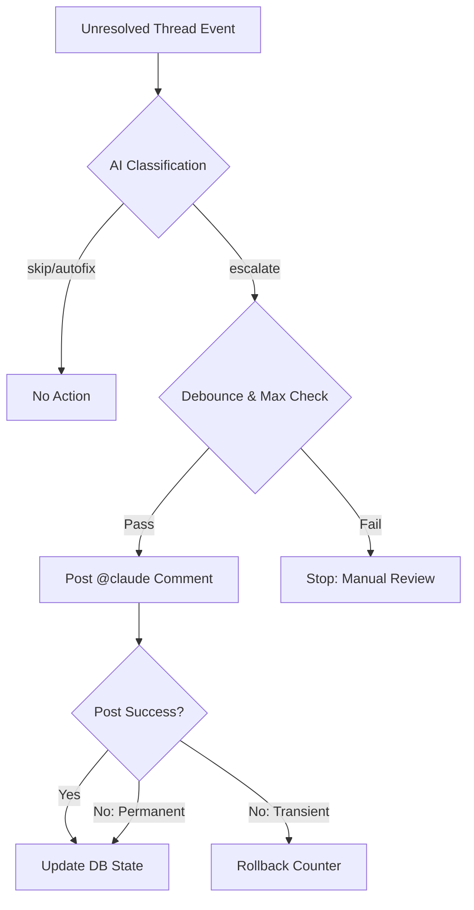

Relevant source files

The following files were used as context for generating this wiki page:

- [README.md](../../README.md)
- [worker/src/index.ts](../../worker/src/index.ts)
- [worker/schema.sql](../../worker/schema.sql)
- [AGENTS.md](../../AGENTS.md)
- [SECURITY.md](../../SECURITY.md)
- [apply-ruleset.sh](apply-ruleset.sh)

# Troubleshooting & Caveats

This page outlines known limitations, operational constraints, and troubleshooting procedures for the **ops-hub** central node. It covers critical areas such as API rate limits, automation safeguards, deployment restrictions, and security protocols.

The system is designed as a lightweight Cloudflare Worker backed by D1 storage to handle real-time decisions for GitHub automations and VPS monitoring. Understanding these caveats is essential for maintaining the reliability of the webhook-triggered workflows and health checks.

Sources: [README.md:1-15](README.md#L1-L15), [AGENTS.md:1-10](AGENTS.md#L1-L10)

## Automation Safeguards & Rate Limits

### CodeRabbit Quota Management
The system tracks GitHub events to prevent exceeding the CodeRabbit Pro-plan limit (5 reviews per hour). A common pitfall is relying on CodeRabbit's own API for real-time status, which only provides historical data for merged PRs.

*  **Caveat:** CodeRabbit lacks real-time "in-progress" or "queued" review endpoints.
*  **Logic:** The `/coderabbit-quota` endpoint calculates a rolling 60-minute window of `pull_request` and `issue_comment` actions that trigger reviews.
*  **Triggering Actions:** `opened`, `synchronize`, `reopened`, `ready_for_review`, and comments tagging `@coderabbitai review`.

Sources: [README.md:94-118](README.md#L94-L118), [worker/src/index.ts:22-26](worker/src/index.ts#L22-L26)

### Escalation Loops
To prevent infinite loops and excessive API costs (e.g., during failed autofix attempts), the AI triage system implements hard limits on PR escalations.

*  **Max Escalations:** A maximum of 3 `@claude` escalations per PR is permitted.
*  **Debounce:** There is a 30-minute debounce period between escalations for the same PR.
*  **Rollback Logic:** The system distinguishes between transient (retryable) and permanent errors. Transient errors (HTTP 5xx) roll back the escalation counter, while permanent errors (HTTP 4xx) do not, allowing the counter to hit the limit and stop the loop.

Sources: [worker/src/index.ts:184-194](worker/src/index.ts#L184-L194), [worker/src/index.ts:258-278](worker/src/index.ts#L258-L278)

The following diagram illustrates the AI Triage flow and the escalation safeguard logic:

Sources: [worker/src/index.ts:220-300](worker/src/index.ts#L220-L300)

## Deployment & Configuration Caveats

### Domain Restrictions
Deploying the Worker to the default `*.workers.dev` subdomain is problematic.
*  **Issue:** Cloudflare's own edge bot protection blocks requests to `workers.dev`, preventing webhooks from reaching the code.
*  **Solution:** Must use a `custom_domain` pattern in `wrangler.jsonc`.

Sources: [README.md:76-80](README.md#L76-L80)

### Permission Scoping
Agencies and automated agents have restricted permissions within the repository to prevent unauthorized infrastructure changes.

| Forbidden Action | Rationale |
| :--- | :--- |
| Push to main/master | Protects branch integrity |
| Modify Secrets | Prevents credential exposure |
| Disable Workflows | Ensures automation persistence |
| Modify branch rulesets via API | Blocked for agents; must use `apply-ruleset.sh` manually |

Sources: [AGENTS.md:18-25](AGENTS.md#L18-L25), [apply-ruleset.sh:2-6](apply-ruleset.sh#L2-L6)

### Database Migration
The D1 schema must be manually migrated after changes.
*  **Local:** `npm run db:migrate:local`
*  **Remote:** `npm run db:migrate:remote`

Sources: [worker/package.json:5-8](worker/package.json#L5-L8)

## Health Check & Token Maintenance

### Health Check Alerts
Health checks for `politiker.denied.se` are transition-based to avoid Slack fatigue.
*  **Transition Logic:** Alerts are only sent when a check moves from `OK` to `FAIL` or vice versa.
*  **Reminders:** If a check remains in `FAIL` status, a reminder is sent every 6 hours.
*  **Daily Summary:** A full status report is generated daily at 07:00.

Sources: [worker/src/index.ts:420-425](worker/src/index.ts#L420-L425), [worker/src/index.ts:544-550](worker/src/index.ts#L544-L550)

### Token Renewal Logic
Cloudflare account tokens are automatically renewed weekly if they expire within 30 days. However, certain tokens have hard-coded restrictions:
*  **Protected Token:** Token ID `7fe0985e91f909d888690eec40625612` (mp100) must never be modified.
*  **Policy Retention:** The `policies` array must be sent unchanged in the `PUT` request to avoid silent access stripping.
*  **GitHub PAT:** Fine-grained PATs (e.g., for `politiker-webapp`) **cannot** be auto-renewed and require manual human intervention.

Sources: [worker/src/index.ts:377-385](worker/src/index.ts#L377-L385), [worker/src/index.ts:397-402](worker/src/index.ts#L397-L402)

## Security Protocols

### Credential Exposure
If secrets are exposed, the following remediation steps are mandatory:
1.  Revoke the token at the provider (GitHub, Cloudflare, etc.).
2.  Follow GitHub's guide for removing sensitive data from repository history.
3.  Update Cloudflare Worker secrets using `wrangler secret put`.

Sources: [SECURITY.md:46-51](SECURITY.md#L46-L51), [README.md:66-75](README.md#L66-L75)

### Auth Endpoints
Endpoints are protected by Bearer tokens or HMAC signatures. Missing or incorrect headers will result in `401 Unauthorized` responses.

| Endpoint | Auth Method |
| :--- | :--- |
| `/webhook/github` | HMAC-SHA256 (`X-Hub-Signature-256`) |
| `/webhook/heartbeat` | `HEARTBEAT_SECRET` Bearer Token |
| `/coderabbit-quota` | `QUERY_SECRET` Bearer Token |

Sources: [README.md:46-52](README.md#L46-L52), [worker/src/index.ts:30-47](worker/src/index.ts#L30-L47)

## Summary
Troubleshooting the **ops-hub** involves verifying webhook signatures, checking Cloudflare D1 migration states, and monitoring the escalation counters in the database. Developers must adhere to the manual token renewal schedule for GitHub PATs and ensure that the Worker is always deployed on a custom domain to bypass bot protection.

Sources: [README.md:120-130](README.md#L120-L130), [worker/schema.sql:1-60](worker/schema.sql#L1-L60)
