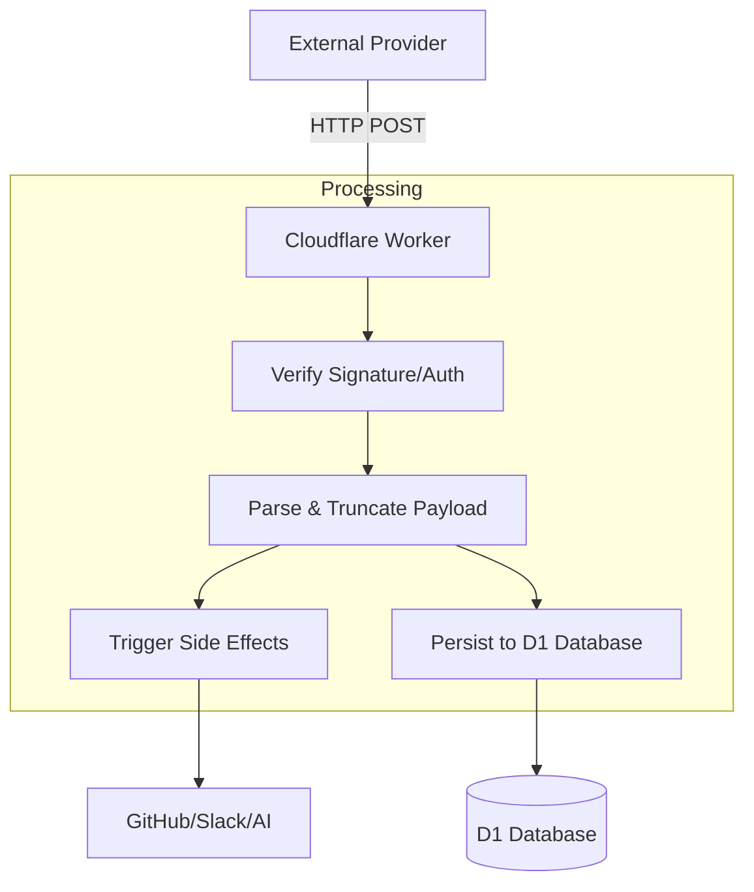
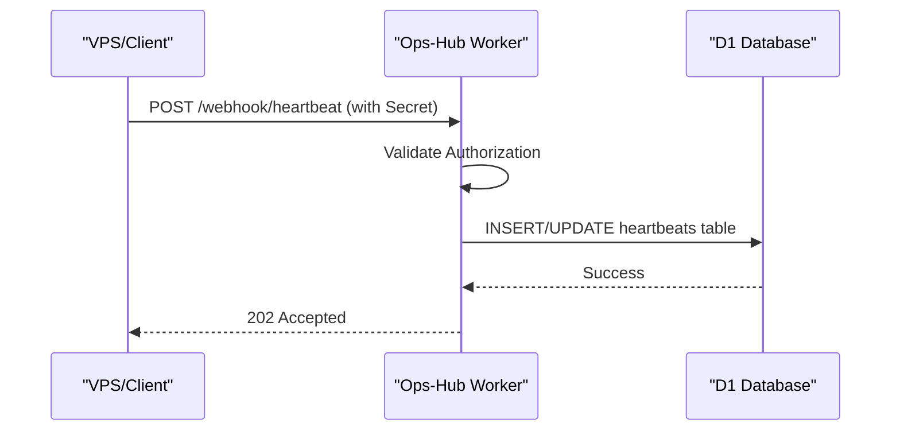

<details>
<summary>Relevant source files</summary>

The following files were used as context for generating this wiki page:

- [worker/src/index.ts](../../worker/src/index.ts)
- [README.md](../../README.md)
- [worker/schema.sql](../../worker/schema.sql)
- [AGENTS.md](../../AGENTS.md)
- [CLAUDE.md](../../CLAUDE.md)
- [clients/heartbeat.sh](../../clients/heartbeat.sh)
</details>

# Adding New Webhook Sources

Adding new webhook sources to **ops-hub** involves extending the central Cloudflare Worker to handle incoming HTTP requests from external providers. The project follows a "node pattern" where webhooks are received, processed, and then persisted to a Cloudflare D1 database for later querying or automated action.

The primary entry point for all webhook logic is located in the Worker's main index file, and new sources are generally implemented as distinct routes with their own signature verification and data processing logic.

Sources: [README.md:120-123](README.md#L120-L123), [AGENTS.md:8-10](AGENTS.md#L8-L10)

## Architecture Overview

The webhook system is designed to be a central hub for notifications from various providers like GitHub and VPS instances. The following diagram illustrates the general data flow for a new webhook source.



The Worker acts as a gatekeeper, verifying the authenticity of the request before processing the payload and storing it in the `events` or `heartbeats` tables.

Sources: [worker/src/index.ts:566-586](worker/src/index.ts#L566-L586), [worker/schema.sql:3-13](worker/schema.sql#L3-L13)

## Implementing a New Webhook Route

To add a new webhook source, you must define a new route within the `route` function of the Worker. Each source should ideally have its own path (e.g., `/webhook/<source-name>`).

### 1. Define the Route
Update the `route` function to intercept requests to the new endpoint.

```typescript
// worker/src/index.ts:709-735
async function route(req: Request, env: Env, ctx: ExecutionContext): Promise<Response> {
  const url = new URL(req.url);

  if (req.method === "POST" && url.pathname === "/webhook/github") {
    return handleGitHubWebhook(req, env, ctx);
  }
  if (req.method === "POST" && url.pathname === "/webhook/heartbeat") {
    return handleHeartbeat(req, env);
  }
  // Add new source here
  if (req.method === "POST" && url.pathname === "/webhook/new-source") {
    return handleNewSource(req, env, ctx);
  }
  // ...
}
```

Sources: [worker/src/index.ts:709-735](worker/src/index.ts#L709-L735), [AGENTS.md:11-13](AGENTS.md#L11-L13)

### 2. Implement Authentication
Security is paramount. You must verify that the request originated from the expected provider. Existing patterns include:
*  **HMAC-SHA256 Signatures**: Used for GitHub (via `X-Hub-Signature-256`).
*  **Bearer Tokens**: Used for Heartbeats (via `Authorization: Bearer <SECRET>`).

| Method | implementation Detail | Reference |
| :--- | :--- | :--- |
| GitHub Signature | `verifyGitHubSignature(payload, signature, secret)` | [worker/src/index.ts:30-52](worker/src/index.ts#L30-L52) |
| Simple Secret | `req.headers.get("authorization") === Bearer ${env.SECRET}` | [worker/src/index.ts:587-590](worker/src/index.ts#L587-L590) |

### 3. Data Persistence
The `events` table in the D1 database is the standard location for logging raw webhook activity. It allows for tracking sources, event types, and associated repositories.

```sql
-- worker/schema.sql:3-13
CREATE TABLE IF NOT EXISTS events (
  id INTEGER PRIMARY KEY AUTOINCREMENT,
  source TEXT NOT NULL,          -- 'github' | 'new-source'
  event_type TEXT NOT NULL,      -- specific action type
  repo TEXT,                     -- relevant repository identifier
  triggers_coderabbit INTEGER NOT NULL DEFAULT 0,
  payload TEXT NOT NULL,         -- raw JSON (truncated if necessary)
  received_at INTEGER NOT NULL   -- unix epoch seconds
);
```

When saving the payload, it is recommended to truncate it (e.g., to 4000 characters) to avoid database bloat, as the payload is primarily used for debugging rather than full archiving.

Sources: [worker/src/index.ts:575-576](worker/src/index.ts#L575-L576), [worker/schema.sql:3-13](worker/schema.sql#L3-L13)

## Example: Heartbeat Webhook

The Heartbeat system serves as a model for adding lightweight webhook sources. It uses a shared secret and a simple JSON structure to track the status of VPS instances.



### Heartbeat Implementation Details
The client sends a POST request with machine stats. The server updates the `heartbeats` table using an `ON CONFLICT` clause to ensure only the latest status per source is preserved.

| Parameter | Type | Description |
| :--- | :--- | :--- |
| `source_id` | String | Unique identifier (e.g., 'mp100') |
| `status` | String | Current state ('up', 'down', etc.) |
| `details` | Object | Arbitrary JSON (CPU, RAM, Disk) |

Sources: [worker/src/index.ts:587-603](worker/src/index.ts#L587-L603), [clients/heartbeat.sh:13-18](clients/heartbeat.sh#L13-L18)

## Side Effects and Background Processing

If a webhook triggers an action that might take time (like calling an external API or Workers AI), use `ctx.waitUntil()` to allow the Worker to respond to the provider immediately while the task continues in the background.

**Common Side Effects:**
*  **AI Triage**: Classifying threads using `env.AI.run()`.
*  **GitHub Mutations**: Arming auto-merge or posting comments via the GitHub GraphQL/REST API.
*  **Slack Alerts**: Posting notifications to Slack (implemented as "best effort" to never block the main request flow).

Sources: [worker/src/index.ts:581-584](worker/src/index.ts#L581-L584), [worker/src/index.ts:639-650](worker/src/index.ts#L639-L650), [worker/src/index.ts:219-225](worker/src/index.ts#L219-L225)

## Conclusion

Adding a new webhook source involves extending the `route` function, implementing robust authentication, and persisting relevant data to D1. By following the established patterns for GitHub and Heartbeat webhooks, developers can ensure that the infrastructure remains simple, secure, and capable of triggering automated workflows across the stack.

Sources: [README.md:120-123](README.md#L120-L123), [AGENTS.md:8-10](AGENTS.md#L8-L10)
