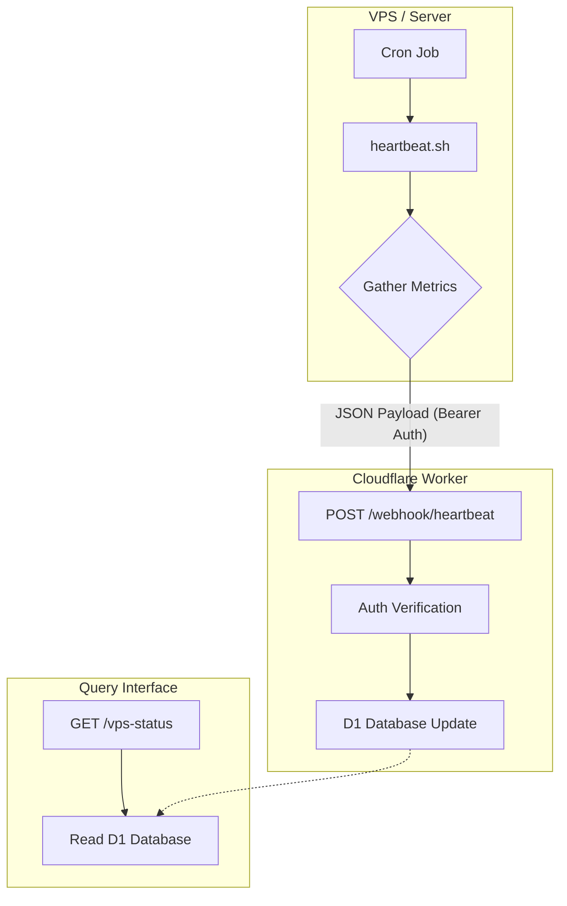
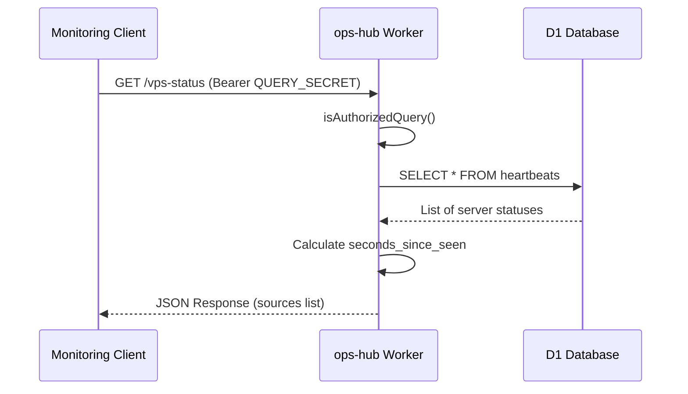

<details>
<summary>Relevant source files</summary>

The following files were used as context for generating this wiki page:

- [README.md](README.md)
- [worker/src/index.ts](worker/src/index.ts)
- [clients/heartbeat.sh](clients/heartbeat.sh)
- [worker/schema.sql](worker/schema.sql)
- [AGENTS.md](AGENTS.md)
</details>

# Integrating VPS Clients

The VPS client integration system in ops-hub provides a mechanism for Virtual Private Servers (VPS) and other services to report their status and health metrics to a central hub. This is primarily achieved through a heartbeat mechanism where clients send periodic "pings" containing status information and resource telemetry to a Cloudflare Worker endpoint.

The integration allows administrators to monitor the real-time status of various servers, such as `mp100`, through a unified interface. This solves the challenge of tracking disparate service states by centralizing logs and heartbeats in a D1 database for querying.

Sources: [README.md:14-16](README.md#L14-L16), [AGENTS.md:1-4](AGENTS.md#L1-L4)

## Architecture and Data Flow

The integration follows a push-based architecture where the VPS (client) initiates a request to the ops-hub worker. The worker validates the request using a shared secret and persists the data in a SQLite-compatible D1 database.



*The diagram shows the lifecycle of a heartbeat from generation on a VPS to consumption via the status endpoint.*

Sources: [README.md:23-35](README.md#L23-L35), [worker/src/index.ts:488-518](worker/src/index.ts#L488-L518)

## Client Implementation

Clients integrate by executing a shell script, typically via a cron job, that collects system metrics and performs an authenticated HTTP POST request to the hub.

### The Heartbeat Script
The reference implementation provided in `clients/heartbeat.sh` collects the following metrics:
- **CPU Usage**: Calculated via `top`.
- **Memory Usage**: Percentage of used RAM calculated via `free`.
- **Disk Usage**: Used space on the root partition via `df`.

Sources: [clients/heartbeat.sh:11-14](clients/heartbeat.sh#L11-L14)

### Deployment via Cron
To ensure continuous monitoring, the client script is designed to be run periodically. A standard configuration involves adding a line to the system crontab:

```bash
*/5 * * * * HEARTBEAT_SECRET=$(cat /path/to/secret) OPS_HUB_URL=https://ops-hub.<domain> /path/to/clients/heartbeat.sh <source-id>
```

Sources: [README.md:100-103](README.md#L100-L103)

## Server-Side Processing

The Cloudflare Worker handles incoming heartbeats through the `handleHeartbeat` function. It requires a `HEARTBEAT_SECRET` provided in the `Authorization` header as a Bearer token.

### Data Validation and Storage
The worker extracts the following fields from the JSON payload:
| Field | Type | Description |
|---|---|---|
| `source_id` | String | Unique identifier for the server (e.g., 'mp100') |
| `status` | String | Current state ('up', 'down', 'maintenance') |
| `details` | JSON | Arbitrary metadata like CPU/RAM/Disk stats |

Sources: [worker/src/index.ts:492-496](worker/src/index.ts#L492-L496), [worker/schema.sql:46-51](worker/schema.sql#L46-L51)

### Upsert Logic
The system uses an "upsert" strategy (INSERT ... ON CONFLICT). If a heartbeat for a specific `source_id` already exists, the record is updated with the new status, the current timestamp (`unixepoch()`), and the latest details.

```sql
INSERT INTO heartbeats (source_id, status, last_seen, details)
VALUES (?, ?, unixepoch(), ?)
ON CONFLICT(source_id) DO UPDATE SET 
    status = excluded.status, 
    last_seen = excluded.last_seen, 
    details = excluded.details
```

Sources: [worker/src/index.ts:501-505](worker/src/index.ts#L501-L505), [worker/schema.sql:45-52](worker/schema.sql#L45-L52)

## Monitoring and Status Querying

The collected data is exposed via a protected `GET /vps-status` endpoint.



*The sequence of retrieving current VPS statuses, including age of the last heartbeat.*

The `handleVpsStatus` function enriches the database rows by calculating `seconds_since_seen`, which represents the time elapsed since the server's last reported heartbeat.

Sources: [worker/src/index.ts:526-535](worker/src/index.ts#L526-L535), [README.md:37-45](README.md#L37-L45)

## Security Considerations

1.  **Shared Secrets**: Authentication for heartbeats is handled via `HEARTBEAT_SECRET`. This secret must be shared with the VPS and is stored as a Cloudflare Worker secret.
2.  **Query Security**: Access to the status endpoint is restricted by `QUERY_SECRET`.
3.  **Encrypted Transport**: All communication between the VPS and the worker is conducted over HTTPS.

Sources: [README.md:82-88](README.md#L82-L88), [worker/src/index.ts:18-24](worker/src/index.ts#L18-L24), [AGENTS.md:12-12](AGENTS.md#L12)

## Conclusion
Integrating a new VPS client into the ops-hub ecosystem requires deploying the `heartbeat.sh` script, configuring a cron job, and ensuring the `HEARTBEAT_SECRET` is correctly set. This system provides a lightweight, resilient way to maintain visibility over distributed infrastructure using Cloudflare's serverless platform.
